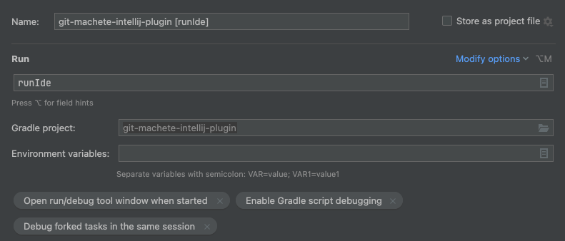

# Development

## Prerequisites

### IntelliJ

Use IntelliJ IDEA Community Edition/Ultimate.

1. (optional) Set up a shortcut for `Plugins` setting, you'll need to access it pretty often.
   Open `Search Actions` dialog with Ctrl+Shift+A (⌘⇧A on macOS),
   type `plugins`, press Alt+Enter (⌥↩ on macOS), then press the chosen shortcut (suggested: Ctrl+Alt+Shift+P, or ⌘⌥⇧P on macOS).

2. Make sure the following bundled plugins are enabled, in the `Installed` tab of `File > Settings > Plugins` (`Preferences > Plugins` on macOS):
   * Git
   * Gradle
   * IntelliLang (for highlighting of language injections, e.g. JavaScript within Scala, or shell script within YAML)
   * Java Internationalization
   * JUnit
   * Lombok
   * Markdown
   * Plugin DevKit
   * Properties
   * Shell Script (also: agree to enable Shellcheck when asked)
   * TOML
   * YAML

3. (optional) If working on IntelliJ Ultimate, enable JavaScript and TypeScript plugin (for UI tests).

4. Install the following non-bundled plugins from Marketplace:
    * [.ignore](https://plugins.jetbrains.com/plugin/7495--ignore)
    * [Kotlin plugin](https://plugins.jetbrains.com/plugin/6954-kotlin) will be useful for editing certain parts of UI, esp. dialogs.
    * [Scala plugin](https://plugins.jetbrains.com/plugin/1347-scala) might be useful for editing UI tests.

5. (optional) Install further non-bundled plugins from Marketplace:
   * [Grammar-Kit IntelliJ plugin](https://plugins.jetbrains.com/plugin/6606-grammar-kit) can be used instead of Gradle plugin
     to manually generate grammar and lexer code from `.bnf` and `.flex` files.
   * [HOCON plugin](https://plugins.jetbrains.com/plugin/10481-hocon) for `.conf` file support in UI tests
   * [PsiViewer IntelliJ plugin](https://plugins.jetbrains.com/plugin/227-psiviewer) can be helpful to see parsing result on the `machete` file
     when running IntelliJ instance with the Git Machete plugin loaded.

6. Enable annotation processing (for Lombok):
   `File > Settings > Build, Execution, Deployment > Compiler > Annotation Processors > Enable Annotation Processing`
   (`Preferences > Build, Execution, Deployment > Compiler > Annotation Processors > Enable Annotation Processing` on macOS).
   Select `Obtain annotation processors from classpath` radio box.

7. (optional) Increase maximum heap size for the IDE (the default value is 2048 MB) under `Help > Change Memory Settings`.

8. (optional) [Enable internal mode](https://plugins.jetbrains.com/docs/intellij/enabling-internal.html).
   It can be significantly useful while working with UI components (or tests).
   To investigate the UI you may want to use `Tools > Internal Actions > UI > UI Inspector`.

9. (optional) Set `Class count before import with '*'` and `Names count to use static import with '*'` to a very high number (e.g. 500)
   to avoid problems with CheckStyle when editing code. To do that go to `File > Settings > Editor > Code Style > Java/Kotlin/Scala`
   (`Preferences > Editor > Code Style > Java/Kotlin/Scala` on macOS).

### Git config/hooks

From the main project folder, run the following commands:

```shell
git config --local include.path ../.gitconfig
ln -s ../../scripts/git-hooks/machete-status-branch .git/hooks/machete-status-branch
ln -s ../../scripts/git-hooks/post-commit .git/hooks/post-commit
ln -s ../../scripts/run-pre-build-checks .git/hooks/pre-commit
```

#### Windows
**The hooks do not work on Windows** (however their execution seems to be possible theoretically).
This is because one may not be emulating bash environment in any way or doing it in some specific way.

#### macOS
Some hooks use `grep`. The macOS version of `grep` (FreeBSD) differs from GNU `grep`.
In order to make `grep` and eventually the hooks working one must:
1. Install `grep` via `brew` (it will not override system's `grep` &mdash; it can be executed as `ggrep`).
2. Run `brew ls -v grep`; among the other a path like should be found `/opt/homebrew/Cellar/grep/<grep-version>/libexec/gnubin/grep`
(or `/usr/local/Cellar/grep/...`).
3. Prepend the found path without `/grep` suffix to `PATH` (`/opt/homebrew/Cellar/grep/<grep-version>/libexec/gnubin` in that case).
You may want to add the following `export PATH="/opt/homebrew/Cellar/grep/<grep-version>/libexec/gnubin:$PATH"` to (`.zprofile`/`.zshrc`).
4. Restart the terminal OR run `source` against the `.zprofile`/`.zshrc` file: for example `source ~/.zshrc`.

It is possible that git `pre-commit` hook will raise the following error: <br/>
`fatal: cannot use Perl-compatible regexes when not compiled with USE_LIBPCRE` <br/>
This can be solved by compiling `git` with USE_LIBPCRE via `brew` using commands: <br/>
```shell
brew install pcre
export USE_LIBPCRE=yes
brew reinstall --build-from-source git
```
It might be necessary to additionally restart the terminal after running mentioned commands.

Also, some issues with `bash` itself have been reported. Make sure that the version you are using is 5.1 or later.

### Windows

Building this project on Windows has been tested under [Git Bash](https://gitforwindows.org/).

Additional setup:
1. Open the Registry Editor (`regedit.exe`).
2. Open path by clicking: `HKEY_LOCAL_MACHINE\SYSTEM\CurrentControlSet\Control\FileSystem`.
3. Find key named: `LongPathsEnabled` and double click.
4. If the data value is 0, change it to 1.


## Build

To build the project, run `./gradlew build`. Please note that for the initial build attempt, you might need to add the `--info` option, in order to respond to the prompt of accepting Gradle Terms of Service.

Currently, very generous maximum heap size options are applied for Gradle's Java compilation tasks (search for `-Xmx` in [build.gradle.kts](build.gradle.kts)). <br/>
To overwrite them, use `compileJavaJvmArgs` Gradle project property
(e.g. `./gradlew -PcompileJavaJvmArgs='-Xmx2g -XX:+HeapDumpOnOutOfMemoryError' build`,
or equivalently with an env var: `ORG_GRADLE_PROJECT_compileJavaJvmArgs='-Xmx2g -XX:+HeapDumpOnOutOfMemoryError' ./gradlew build`).

Local (non-CI) builds by default skip most of [Checker Framework's](https://checkerframework.org/manual/) checkers to speed up Java compilation.<br/>
To make local builds more aligned with CI builds (at the expense of ~2x longer compilation from scratch),
set `runAllCheckers` Gradle project property (e.g. `./gradlew -PrunAllCheckers build`).

In case of spurious cache-related issues with Gradle build, try the following remedies (in the order from the least intrusive to the most):
* `./gradlew --stop` to shut down Gradle daemon
* `pkill -e -9 -f '.*Gradle.*'` to kill all Gradle processes
* `./gradlew clean` and re-run the failing `./gradlew` command with `--no-build-cache`
* remove .gradle/ directory in the project directory
* remove ~/.gradle/caches/ (or even the entire ~/.gradle/) directory
* reinstall Gradle AND remove the entire ~/.gradle/ directory


## Run

To run an instance of IDE with Git Machete IntelliJ Plugin installed from the current source,
execute `:runIde` Gradle task (`Gradle panel > Tasks > intellij > runIde` or `./gradlew runIde`).

It's possible to use a different version of IDE than the automatically chosen one (see [IntelliJVersions](buildSrc/src/main/kotlin/com/virtuslab/gitmachete/buildsrc/IntellijVersions.kt))
for building the plugin and running the IDE:
use a project property `overrideBuildTarget` e.g. `./gradlew runIde -PoverrideBuildTarget=2022.1.4`.

To watch the logs of this IntelliJ instance, run `tail -f build/idea-sandbox/system/log/idea.log`.

### Debug

To debug the plugin using IntelliJ go to `Run > Edit Configurations...` and create a new Run Configuration for Gradle: </br>


Now this new configuration can be chosen in the upper left corner of the IDE, and the debugging can be started with the Debug button or Shift+F9 (^D on macOS).


## Test

To force running tests (without using `./gradlew clean` and/or `./gradlew --no-build-cache ...`, which lead to unnecessary longer build times),
set `forceRunTests` project property: `./gradlew -PforceRunTests test`.

To include test stdout/stderr in the output of tests (without enabling `--info` log level in Gradle, which leads to a lot of spam),
set `printTestOutput` project property: `./gradlew -PprintTestOutput test`.

### Run UI tests

```shell
./gradlew [-Pagainst=<e.g. 2021.2>] [-PvirtualDisplay] [-Ptests=<e.g. toggle>] uiTest
```

See [Robot plugin](https://github.com/JetBrains/intellij-ui-test-robot)
and [a preso on testing UI of IntelliJ Plugins](https://slides.com/plipski/intellij-plugin-ui-testing) for more details.

#### macOS

It is not possible to run `uiTest` Gradle task in display mode `Xvfb` on macOS systems directly via `./gradlew`.
You can run UI tests inside Docker container (based on `gitmachete/intellij-plugin-ci` image) or using a Linux virtual machine.
Sample configuration for launching docker container is shown below. Environment variables `UID` and `GID` placed into the container will be the user and group identifiers
of the files created inside it. In example below, current working directory navigates to top-level directory of the project. When starting the container we should care about setting
environment variable `IDEPROBE_PATHS_BASE` to the directory to which the user whose `UID` and `GID` was passed to the container has access to (e.g. user's home directory).
```shell
./gradlew --stop  # to avoid conflicts on Gradle's internal lock files
docker run --rm -e UID=$(id -u) -e GID=$(id -g) \
      -v "$PWD":/home/docker/git-machete-intellij-plugin \
      -v ~/.gradle:/home/docker/.gradle \
      -v ~/.pluginVerifier:/home/docker/.pluginVerifier \
      -v /tmp/ide-probe/cache:/tmp/ide-probe/cache \
      -w /home/docker/git-machete-intellij-plugin \
      gitmachete/intellij-plugin-ci \
      ./gradlew -PvirtualDisplay uiTest
```


## Generate and/or install snapshot build of the plugin

To generate a plugin archive (zip), run `:buildPlugin` Gradle task (`Gradle panel > Tasks > intellij > buildPlugin` or `./gradlew buildPlugin`).<br/>
The resulting file will be available under `build/distributions/`. <br/>
Alternatively, download the plugin zip from the artifacts of the given build
in [CircleCI](https://app.circleci.com/pipelines/github/VirtusLab/git-machete-intellij-plugin).

In either case (locally-built or CI-built), the zip can be installed via `File > Settings > Plugins > (gear icon) > Install Plugin from Disk...`
(`Preferences > Plugins > (gear icon) > Install Plugin from Disk...` on macOS).
Select the zip and restart the IDE.


## Logging

By default, IntelliJ logs everything with level `INFO` and above into `idea.log` file. <br/>
The exact location depends on a specific IntelliJ installation; check `Help > Show Log in Files` (`Help > Show Log in Finder` on macOS) to find out. <br/>
Tip: use `tail -f` to watch the log file as it grows.

To enable logging of this plugin in `DEBUG` level, add `com.virtuslab` category to list in `Help > Diagnostic Tools > Debug Log Settings`. <br/>
A relatively small amount of `TRACE`-level logs is generated as well (`com.virtuslab:trace` to enable).


## Coding conventions

Most non-standard/project-specific conventions are enforced by:

* [pre-commit hook](scripts/run-pre-build-checks)
* [Spotless](https://github.com/diffplug/spotless/tree/master/plugin-gradle) for Java code formatting
  (see [Eclipse-compatible config](config/spotless/formatting-rules.xml))
* [Checkstyle](https://checkstyle.sourceforge.io/) for code style/detecting basic smells
  (see the [config](config/checkstyle/checkstyle.xml))
* [ArchUnit](https://www.archunit.org/userguide/html/000_Index.html) for forbidden method calls/class naming patterns etc.
  (see [tests in top-level project](src/test/java/com/virtuslab/archunit))
* [Checker Framework](https://checkerframework.org/manual/) for formal correctness, esp. wrt. null safety and UI thread handling
  (most config in [build.gradle.kts](build.gradle.kts), stubs in [config/checker/](config/checker))

Other coding conventions include:

* Don't write nullary lambdas in `receiver::method` notation, use explicit `() -> receiver.method()` notation instead. <br/>
  `::` notation is confusing when applied to parameterless lambdas, as it suggests a unary lambda.
* Use `get...` method names for pure methods that only return the value without doing any heavy workload like accessing git repository. <br/>
  Use `derive...` method names for methods that actually compute their result and/or can return a different value every time when accessed.
* Non-obvious method params that have values like `false`, `true`, `0`, `1`, `null`, `""` should be preceded with a `/* comment */ `
  containing the name of the param.
* Avoid running code outside IDE-managed threads.
  Use either UI thread (for lightweight operations) or `Task.Backgroundable` (for heavyweight operations).
* Properties in `GitMacheteBundle.properties` that use HTML should be wrapped in tags `<html>` ... `</html>`.
  Additionally, their keys should have a `.HTML` suffix.
* `@Tainted` and `@Untainted` annotations are used in the context of method parameters that may or may not use HTML. Those annotated with `@Untainted` should not contain HTML tags, whereas values annotated with
  `@Tainted` can contain HTML (but they don't have to). Please note that you need to use `org.checkerframework.checker.tainting.qual.Tainted` or `org.checkerframework.checker.tainting.qual.Untainted` annotations, rather than the `javax.annotation` ones.
* Avoid `Branch` word in action class names and action ids to keep them shorter.
  Some exceptions are allowed (e.g. the backgroundable task classes).


## UI conventions

So far created UI conventions:

* Add `…` (ellipsis, `\u2026`)  at the end of an action name if it is not executed immediately after clicking e.g. `Sync to Parent by Rebase…` (after this operation the interactive rebase window opens)
* Toolbar name texts of a **toolbar** actions that refer to a branch should indicate the branch under action with the word `Current`.
  On the other hand, **context-menu** actions text names should be kept short (**no** `This`/`Selected`).


## Rebuild the CI base image

To push the rebuilt image, you need write access to [`gitmachete` organization on Docker Hub](https://hub.docker.com/orgs/gitmachete).
`Dockerfile` together with the necessary `entrypoint.sh` exists under `docker` folder in project root directory.
```shell
cd docker/
version=...  # determine the image version using Semantic Versioning rules
docker build -t gitmachete/intellij-plugin-ci:$version -t gitmachete/intellij-plugin-ci:latest .
docker push gitmachete/intellij-plugin-ci:$version
docker push gitmachete/intellij-plugin-ci:latest
```

Then, update `executors.docker_executor.docker[0].image` in [.circleci/config.yml](.circleci/config.yml).


## Versioning

We follow [Semantic versioning](https://semver.org/) for the plugin releases:

* MAJOR version must be bumped for each plugin release that stops supporting any IDEA build (typically when `sinceBuild` is increased). <br/>
  This does not apply to 0->1 major version transition, which is going to happen when the plugin's compatibility range is considered stable.
* MINOR version must be bumped for each plugin release that either adds a new user-facing feature
  or starts supporting a new quarterly (`year.number`) IDEA build (typically when `untilBuild` is increased).
* PATCH version must be bumped for each plugin release that adds no new user-facing features
  and doesn't change the range of supported IDEA builds.

### Sample sequence of versions between releases

After a release e.g. `1.0.3`, subsequent PRs merged to `develop` might change `PROSPECTIVE_RELEASE_VERSION`
in [version.gradle.kts](version.gradle.kts) in the following way:
1. `1.0.4` (bugfix PR)  &mdash; the first PR merged to develop after the release must bump `PROSPECTIVE_RELEASE_VERSION` since of course the prospective release won't be `1.0.3` anymore
1. `1.0.4` (bugfix PR)  &mdash; even if a new set of patch-level changes has been added on the PR, the released version is still going to be `1.0.4` (not `1.0.5`)
1. `1.1.0` (feature PR) &mdash; since we've just added a new feature, the new release won't be a PATCH-level anymore, but MINOR-level one
1. `1.1.0` (bugfix PR)  &mdash; even if a new feature has been added on the PR, the released version is still going to be `1.1.0` (not `1.2.0`)
1. `2.0.0` (breaking change PR)
1. `2.0.0` (feature PR) &mdash; again, still `2.0.0` and not e.g. `2.1.0`
1. `2.0.0` (bugfix PR)
1. `2.0.0` (release PR) &mdash; finally releasing as a major release; as a consequence, `1.0.4` and `1.1.0` never actually gets released

### Change notes

Change notes are stored in [CHANGE-NOTES.md](CHANGE-NOTES.md) file.
The file is incremental, all previous versions' information are stored there and never deleted. <br/>
Change notes should only be added as new bullet points listed under `Unreleased` section of the file. <br/>
Change notes should contain only the **user-facing** plugin alterations like new features, public-requested bug fixes, etc. <br/>
In spite of the above, change notes can sometimes contain a general description of the work done in the new version
if the alternative is leaving them empty, which should be avoided.
The change notes should be in past tense (e.g. use `Added...` instead of `Add...`);
(if possible) they should start with words `Added`, `Changed`, `Deprecated`, `Removed`, `Fixed`, etc.;
they should be described in full sentences and end with a period;
Special phrases like action name references should be highlighted with `<i>...</i>`.

### Supported IDE versions

Since we cannot skip `untilBuild` field in a plugin build configuration
(see related [issue](https://github.com/VirtusLab/git-machete-intellij-plugin/issues/460)
and [YouTrack ticket](https://youtrack.jetbrains.com/issue/IJSDK-888)),
the most reasonable approach is to bump `untilBuild` to `X.*` when the new `X` EAP or RC version is released.

Once stable (non-EAP/RC) `X` is released, we should verify ASAP that our plugin is compatible with `X`.
There is a rather little risk that the plugin which is compatible with `X - 1`
and does **not** use any `X EAP/RC`-specific API
turns out to be **not** compatible with stable `X` release of IDE.

Version updates are performed automatically by a cronned CI job using `./gradlew updateIntellijVersions`, see [.circleci/config.yml](.circleci/config.yml).

The whole logic of the process can be illustrated with an example:
1. our plugin in version `0.7.0` is compatible with IntelliJ `2020.2`
2. then IntelliJ `2020.3-EAP` is released (see [snapshot repository](https://www.jetbrains.com/intellij-repository/snapshots/) -> Ctrl+F `.idea`),
   and is detected with `./gradlew updateIntellijVersions`, <br/>
   new `eapOfLatestSupportedMajor` is set in [intellijVersions.properties](intellijVersions.properties)
3. we check if `0.7.0` is compatible with IntelliJ `2020.3-EAP` &mdash; see if the CI pipeline passes (this will both check binary compatibility and run UI tests against the given EAP)
4. we release the plugin as `0.8.0` (`untilBuild` will extend automatically to `2020.3.*`
   via `latestSupportedMajor` in [intellijVersions.properties](intellijVersions.properties))
5. new stable version `2020.3` is released (see [release repository](https://www.jetbrains.com/intellij-repository/releases/) -> Ctrl+F `.idea`)
   and is detected using `./gradlew updateIntellijVersions`, <br/>
   `latestStable` and additionally `latestMinorsOfOldSupportedMajors` are changed in [intellijVersions.properties](intellijVersions.properties)
6. we verify ASAP that `0.8.0` is binary compatible with `2020.3` as well
7. since `latestStable` is used as the version to build against,
   a few _source_ incompatibilities might appear once `latestStable` is updated, even when the plugin was _binary_ compatible with the new IDE version.


## PRs & releases

The default branch of the repository is `master`, but each regular (non-hotfix, non-release, non-backport) PR must be merged to `develop`. <br/>
Because of that all regular PR branches should start from `develop` and not `master`.  <br/>
Due to the fact that the default branch is not `develop`, merging of PRs does not close linked issues (you have to close the issues manually). <br/>
Stacked PRs (Y -> X -> `develop`) must never be merged until their base is finally changed to `develop`.
After merging the parent PR, child's base changes automatically (see [GitHub blogpost](https://github.blog/changelog/2020-05-19-pull-request-retargeting/))

To create a release:
* make sure the `Unreleased` section in [CHANGE-NOTES.md](CHANGE-NOTES.md) is updated, especially that it is not empty
* run `./gradlew patchChangeLog`, <br/>
this will create a new section named `v<version>` by consuming everything listed under `Unreleased`
* merge patched [CHANGE-NOTES.md](CHANGE-NOTES.md) into `develop`
* open PR from `develop` to `master`

Once the release PR is fast-forward merged (do **not** use GitHub Merge Button), `master` is built. <br/>
After manual approval, the `master` build:
* pushes a tag (`v<version>`) back to the repository
* creates a [GitHub release](https://github.com/VirtusLab/git-machete-intellij-plugin/releases)
* **publishes the plugin to JetBrains marketplace**

Backport PRs are recognized by the `backport/*` branch name.
They must have `develop` as its base.

Hotfix PRs (`hotfix/*` branch name) are PRs to `master` but NOT from `develop` commit.
They always introduce a non-linear history on `develop` since after a hotfix PR is merged,
a backport PR from hotfixed `master` to `develop` is opened, and it cannot be fast-forward merged. <br/>
The alternative that would preserve linear history is to rebase the `develop` history
since the latest release over the hotfixed `master`.
This would mean, however, that the commits referenced from PRs previously merged to `develop` will no longer be part of `develop`'s history,
which is rather unacceptable.

## Plugin signing

The valid non-expired key pair together with the password required for the plugin signing should be present in the CI environment.
If they are absent, please take a look at the [plugin signing in IntelliJ](https://plugins.jetbrains.com/docs/intellij/plugin-signing.html#signing-methods) for updated instructions on how to do it.
Currently, you would need to first generate the private key with:
```shell
export PLUGIN_SIGN_PRIVATE_KEY_PASS="Change2UrStr0ngP4ssword4PrivateKi"
```
```shell
openssl genpkey\
  -aes-256-cbc\
  -algorithm RSA\
  -out private.pem\
  -pkeyopt rsa_keygen_bits:4096\
  -pass env:PLUGIN_SIGN_PRIVATE_KEY_PASS
```
Then, use that for generating the certificate chain by running:
```shell
openssl req\
  -key private.pem\
  -new\
  -x509\
  -days 365\
  -out chain.crt\
  -passin env:PLUGIN_SIGN_PRIVATE_KEY_PASS\
  -subj "/C=PL/ST=Krakow/L=Krakow/O=VirtusLab/OU=Git Machete team/CN=www.virtuslab.com/emailAddress=gitmachete@virtuslab.com"
```

### Plugin signing as part of the CI publish process through the Gradle Plugin

Please note that you would have to copy the contents of `private.pem`, `chain.crt`, and `PLUGIN_SIGN_PRIVATE_KEY_PASS`,
in the [corresponding environment variables](https://app.circleci.com/settings/project/github/VirtusLab/git-machete-intellij-plugin),
in order for the Gradle IntelliJ Plugin to pick them up and use them for the plugin signing task, before publishing to the Marketplace.
For doing so, on a macOS system you can follow the below instructions (on Linux, use `xclip -selection clipboard` instead of `pbcopy`):

1. Type the following command for copying the contents of the private key to the clipboard
    ```shell
    cat private.pem | base64 -w 0 | pbcopy
    ```
2. Create an environment variable named `PLUGIN_SIGN_PRIVATE_KEY_BASE64` on the CI, and paste the content from the clipboard as its value.
3. for copying the contents of the certificate to clipboard:
    ```shell
    cat chain.crt | base64 -w 0 | pbcopy
    ```
4. Create an environment variable named `PLUGIN_SIGN_CERT_CHAIN_BASE64` on the CI, and paste the content from the clipboard as its value.
5. Type the following command for copying the value of the private key password to the clipboard
    ```shell
    echo "$PLUGIN_SIGN_PRIVATE_KEY_PASS" | pbcopy
    ```
6. Create an environment variable named `PLUGIN_SIGN_PRIVATE_KEY_PASS` on the CI and paste the contents of the clipboard as its value.

### Local plugin signing for test, through the Gradle plugin

```shell
export PLUGIN_SIGN_PRIVATE_KEY_BASE64=$(base64 -w 0 < private.pem)
export PLUGIN_SIGN_CERT_CHAIN_BASE64=$(base64 -w 0 < chain.crt)
```

Then run `./gradlew publishPlugin` to produce the unsigned and signed `.zip` files in the `build/distributions/` directory.
If an unsigned zip is already present there, then you can run `./gradlew signPlugin` to produce the signed zip file.

#### Local plugin signing for test, through the IntelliJ CLI

You need to download the [IntelliJ signer CLI](https://github.com/JetBrains/marketplace-zip-signer/releases). Then, following the [instructions](https://plugins.jetbrains.com/docs/intellij/plugin-signing.html#cli-tool) you should run:

```shell
java -jar marketplace-zip-signer-cli.jar sign\
  -in "$(./gradlew -q printPluginZipPath)"\
  -out "build/distributions/signed-machete-plugin.zip"\
  -cert-file "/path/to/chain.crt"\
  -key-file "/path/to/private.pem"\
  -key-pass "$PLUGIN_SIGN_PRIVATE_KEY_PASS"
```


## Scenario recordings

There is a test suite `com.virtuslab.gitmachete.uitest.UIScenarioSuite` that helps to re-record the scenario recordings.
The most effective way to record all scenarios (probably) is to record all scenarios and trim the video.
To record the screen you can use Quick Time Player (on macOS).
The scenario suite **is not** fully automatic.
The following steps shall be performed manually at the beginning:
- resize the tool window to ~4/5 of IDE window height (to show all toolbar actions and avoid the context-menu exceeding the window area)
- increase the font size to 16
- resize the rebase dialog (to fit inside the window area)
- sometimes an IDE internal error occurs &mdash; clear it

The suite covers only scenarios &mdash; recordings for [features](docs/features.md) must be updated manually.
Gifs can optimized with https://www.xconvert.com/ &mdash; over 50% size reduction.
