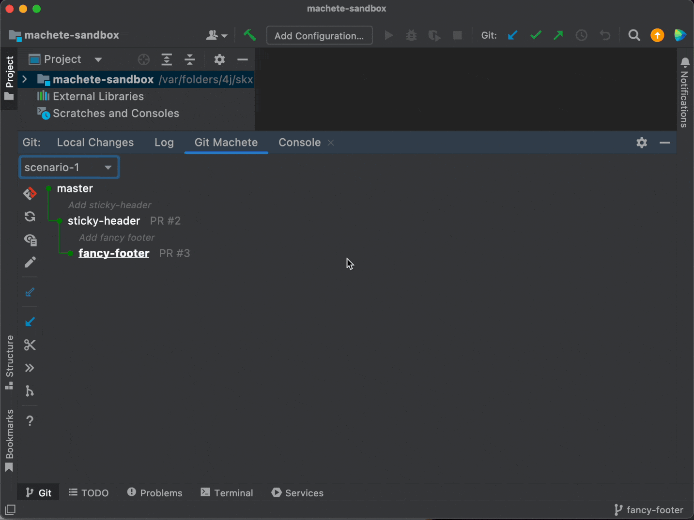
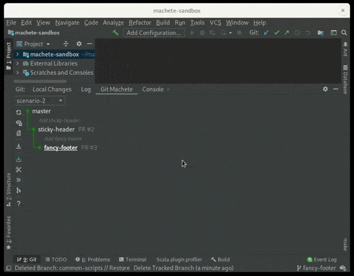
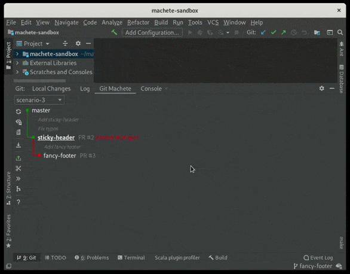
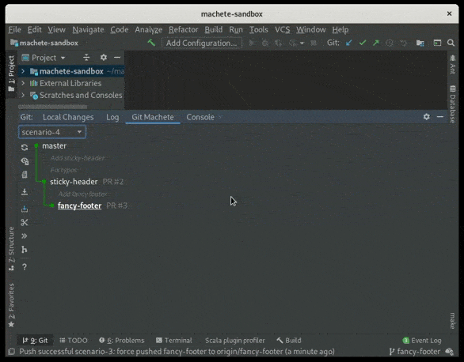

# Git Machete IntelliJ Plugin

[](https://gitter.im/VirtusLab/git-machete)
[](https://app.circleci.com/pipelines/github/VirtusLab/git-machete-intellij-plugin?branch=master)
[](https://plugins.jetbrains.com/plugin/14221-git-machete)
[](https://plugins.jetbrains.com/plugin/14221-git-machete)


💪 Git Machete plugin is a robust tool that **simplifies your git related workflow**.
It's a great complement to the JetBrains products' built-in version control system.<br/>

🦅 The _bird's eye view_ provided by Git Machete makes **merges/rebases/push/pulls hassle-free**
even when **multiple branches** are present in the repository
(master/develop, your topic branches, teammate's branches checked out for review, etc.).<br/>

👁 A look at a Git Machete tab gives an instant answer to the questions:

* What branches are in this repository?
* What is going to be merged (or rebased/pushed/pulled) and to what?

<p align="center">
    
</p>

🎯 With this plugin, you can maintain **small, focused, easy-to-review pull requests** with little effort.

⚙ It is compatible with all JetBrains products (IntelliJ IDEA, PyCharm, Android Studio etc.).
The latest plugin version is available for IDE versions from 2022.1 onwards. <br/>
Earlier plugin versions (which might not have all the latest features & fixes)
are available for earlier IDE versions as well, starting from as early as 2020.1.


🖥 For the console version, check [git-machete](https://github.com/VirtusLab/git-machete#git-machete).


## Installing from JetBrains Marketplace

This plugin is available on [JetBrains Marketplace](https://plugins.jetbrains.com/plugin/14221-git-machete). <br/>
To install this plugin go to `File > Settings > Plugins` (`Preferences > Plugins` on macOS) in your IDE,
then make sure you are on `Marketplace` tab (not `Installed`), in search box type `Git Machete` and click `Install`. <br/>
After installation, depending on the IDE version, the restart may be required.
In that case, just click `Restart IDE` and confirm that action in a message box.


## Where to find the plugin tab

Git Machete IntelliJ Plugin is available under the `Git` tool window in the `Git Machete` tab.
You can find the `Git` tool window in the lower left corner of the screen.<br/>
You can also use `Ctrl + Alt + Shift + M` (`⌘⌥⇧M` on macOS) shortcut to open it.


## Getting started with Git Machete

The examples below show a few common situations where Git Machete proves exceptionally useful.

**If you are a Git Master or have used the [git-machete CLI](https://github.com/VirtusLab/git-machete#git-machete) already,
you may want to jump directly to the [features](docs/features.md).**


### Scenario 1: Review

Let's start with a very common case of review.
Suppose that you work on two branches: `sticky-header` and `fancy-footer`
(you've split your work among these two branches to keep the PRs small and easily reviewable).

In the meantime, a teammate of yours requested a review of their PR for branch `common-scripts`...



Git Machete allows you to check out the remote branch with `Slide In`.
Alternatively, you could check out it via git CLI or Git Branches widget in IntelliJ.
Once the review is complete, you can simply check out any other branch from the right-click menu or by a double click &mdash; `master` in the example.

Once the branch `common-scripts` is no longer needed for review, it can be slid out (`Slide Out`) &mdash; deleted from the branch layout and optionally the branch can be removed from the local repository.


### Scenario 2: Branch update

Some time passed and your teammate has merged the `common-scripts` before you managed to merge your branches.
You are supposed to update `master` and your branches now.



Firstly, you can fetch all changes from the remote using `Fetch All`. <br/>
As you'd expect, your local `master` is behind its remote, so you perform `Pull` to get it in sync.
Note that the pull via Git Machete plugin does **not** require checking out the given branch.

The edge between `master` and `sticky-header` turned red.
It means that there are some commits belonging to the parent (`master`) branch that are not reachable from the child (`sticky-header`).
In case of `master`, these commits came from the recently merged `common-scripts`.

To put `sticky-header` back in sync to `master` two options are available &mdash; `Checkout and Sync to Parent by Rebase ...` or `Checkout and Sync to Parent by Merge ...`
Fortunately, there are no conflicts to resolve. <br/>
Once `sticky-header` is rebased or merged, you can do the same for `fancy-footer`.

You may want to update the remotes as well.
To do so, perform `Push...` for both of the branches.
The push can be done even for a branch that is **not** currently checked out.
Note that force push is required (as you have rebased the branches since the latest push).

After the rebases and pushes, all of your branches are back in sync &mdash; both to their parents and to their remotes.


### Scenario 3: Commit to parent branch (sequential branch setup)

A review of your `sticky-header` has been done and all you've applied and committed all the fixes. <br/>
Git Machete shows that `sticky-header` is ahead of its remote.
Furthermore, the edge between `sticky-header` and `fancy-footer` is red.
The solution to this situation will not differ much from the previous scenario...



You can start with `Checkout and Sync to Parent by Rebase...` to place `fancy-footer` back on top of `sticky-header`.
Now `Push...` both branches.
Everything is back in sync again.


### Scenario 4: Merge (maintaining linear history)

A PR for your `sticky-header` branch has been approved and is ready to merge. <br/>
To make `git revert` & `git bisect` easier and generally simplify diagnostics & providing fixes in production settings,
let's stick to linear git history and thus perform merges that do **not** produce the actual merge commits. <br/>
The way to go is to [fast-forward merge](https://git-scm.com/docs/git-merge#_fast_forward_merge) `sticky-footer` into `master`.



Note that `Fast-forward Merge into Parent` does not require you to check out the branch getting merged (or its parent) beforehand.
You can perform it while some other branch is checked out &mdash; `fancy-footer` in our case.

Once the fast-forward merge is complete, the edge between `master` and `sticky-header` gets gray, which means that the latter has been merged. <br/>
`master` is now ahead of remote because of the commits from `sticky-header`.
Since `master` hasn't diverged from its remote tracking branch, `Push...` does not require force.

You can now `Slide Out` the merged `sticky-header` branch.
The remaining `master` and `fancy-footer` branches are now in sync.


## Complete feature list

Please see the [feature list](docs/features.md) for more specific feature description.


## Build

Please see the [development documentation](CONTRIBUTING.md) for instructions on how to build this plugin on your own.


## Issue reporting

If you see any bug or just would like to propose any new feature, feel free to create an issue.

When reporting a bug, it'd be very helpful for us if you could enable the IntelliJ logging on a DEBUG level, reproduce a bug
and include the logs from IntelliJ in the issue.

Go to `Help > Diagnostic Tools > Debug Log Settings` and then paste the following lines:

```
binding
branchlayout
gitcore
gitmachete.backend
gitmachete.frontend.actions
gitmachete.frontend.graph
gitmachete.frontend.ui
```

Then reproduce the bug and go to `Help > Show Log in Files` (`Help > Show Log in Finder` on macOS) to open the log file.


## References

For additional background on what we believe are good practices take a look into our [slides presentation](http://slides.com/plipski/git-machete).
It explains our motivations and gives you an overview of main Git Machete objectives.

For more information about the plugin,
see the [teaser blog post](https://medium.com/virtuslab/take-a-look-at-your-repository-from-a-new-perspective-with-git-machete-plugin-e2e5e4197a0b)
and the [complete feature list](docs/features.md).

See also [git-machete](https://github.com/VirtusLab/git-machete#git-machete) &mdash; a CLI version of this plugin.
