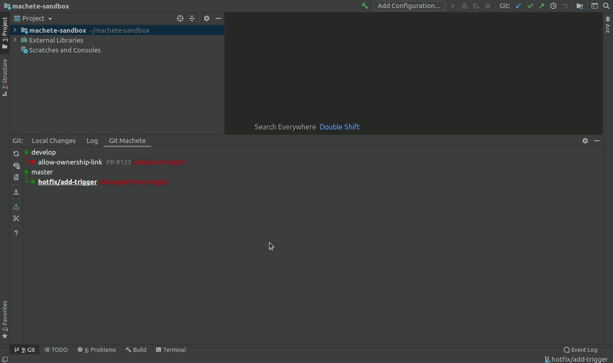
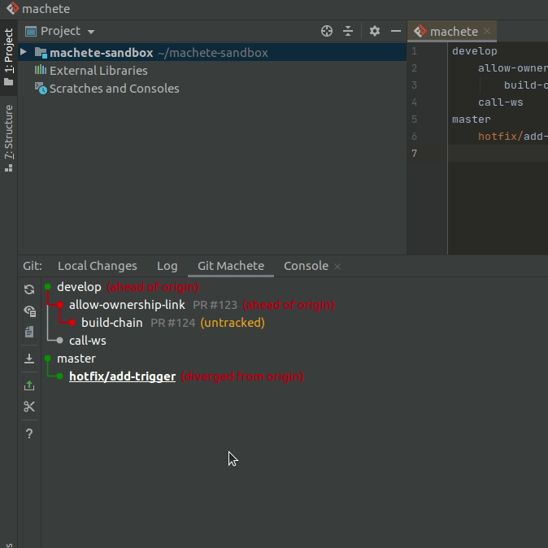
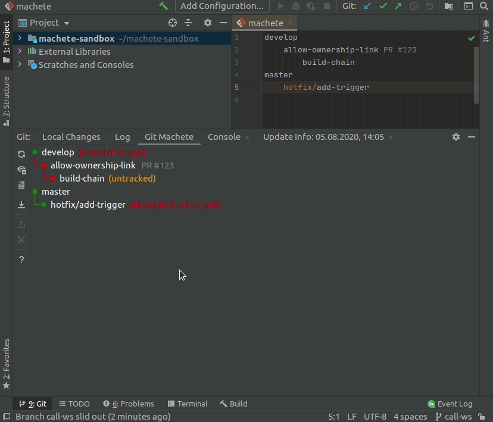
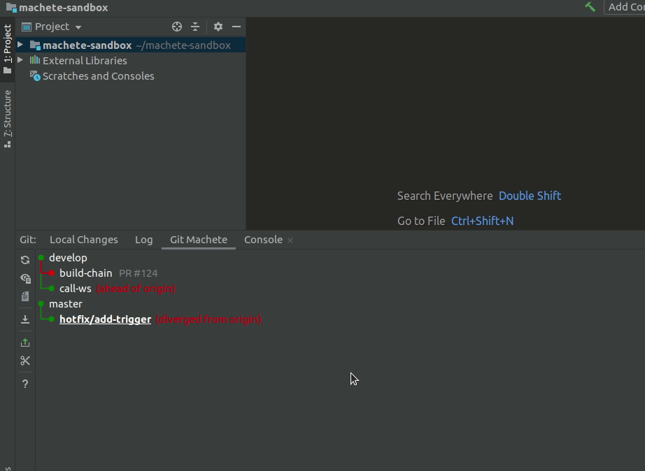
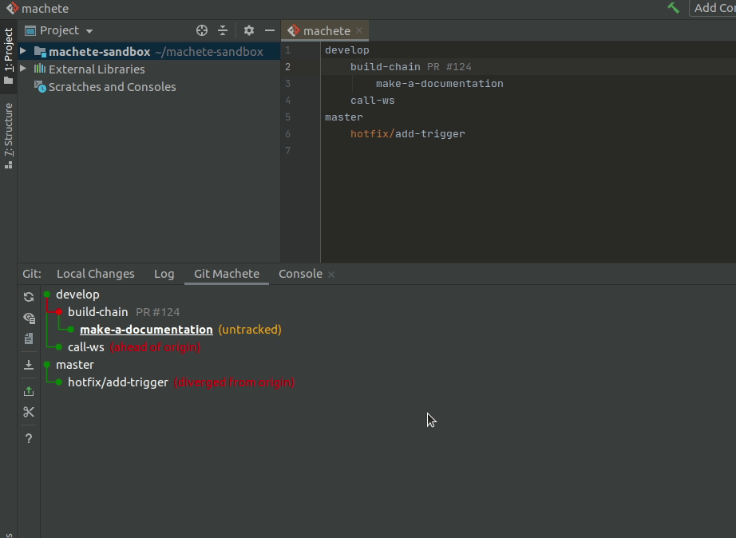
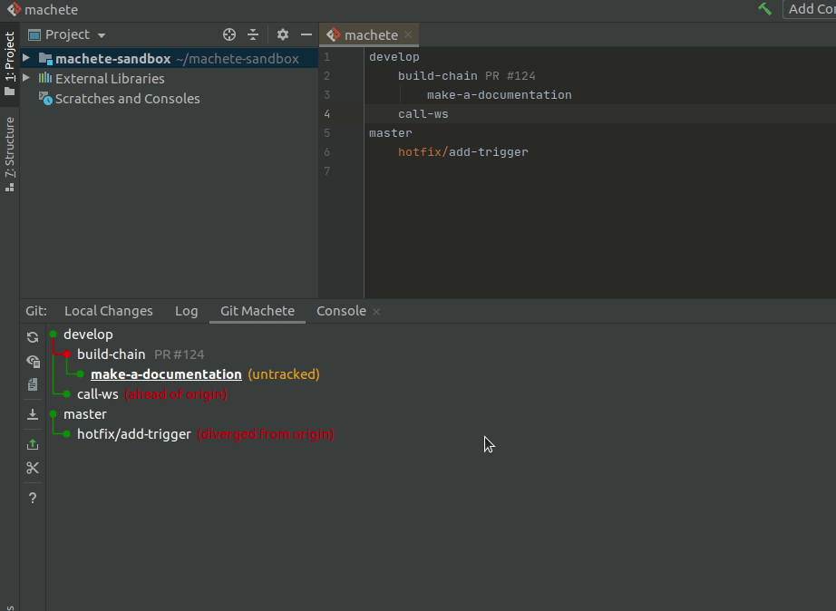

# Git Machete IntelliJ Plugin

[](https://circleci.com/gh/VirtusLab/git-machete-intellij-plugin/tree/master)
[](https://plugins.jetbrains.com/plugin/14221-git-machete)
[](https://plugins.jetbrains.com/plugin/14221-git-machete)


This is a port of [git-machete](https://github.com/VirtusLab/git-machete#git-machete) into an IntelliJ plugin.

This plugin is available on [JetBrains Marketplace](https://plugins.jetbrains.com/plugin/14221-git-machete).




## How it works

Git Machete IntelliJ Plugin is a port of a great console tool - [git-machete](https://github.com/VirtusLab/git-machete#git-machete) - into an IntelliJ plugin.
Git Machete can help you manage your repository branches and keep it in sync with each other and its counterparts on remote repository.
Let's see how this plugin can help you:

### Where to find this plugin window

Git Machete IntelliJ Plugin is available under `Git` section (in the bottom of the IDE) in the `Git Machete` tab.
You can also use `Ctrl` + `Alt` + `Shift` + `M` shortcut to open this plugin.


### Machete file editor

If you are familiar with console equivalent of this tool ([git-machete](https://github.com/VirtusLab/git-machete#git-machete)) then for sure you know what is the `machete` file.
For those who don't know this yet, `machete` file is located inside `.git` directory in your repo.
It describes relation between branches in your repository (these relations are probably determined by order of branch creation - which branch form which - but this is not a rule).
For more information look at the [reference blog post](https://medium.com/virtuslab/make-your-way-through-the-git-rebase-jungle-with-git-machete-e2ed4dbacd02). <br/>
Machete file editor will help you to manage `machete` file: it underlines any errors (bad indentation or nonexistent branches) and propose branch names based on local repository branches.
When file editing is done, you can click button in top right corner of file editor to refresh machete branch tree.


### Checking out branches

With Git Machete you can easily check out branches that have been defined in `machete` file.
Just right click on the branch you wont to check out and select `Checkout Branch`.
You can also double-click on the selected branch to check it out.
Current branch is underlined in branch tree.


### Listing commits

Git Machete can display commits belonging to the branches.
It displays only these commits that are unique for the selected branch.
When you click on eye button on the left side of plugin, you can toggle between show and hide commits.


### Rebase

When branch tree is created, Git Machete indicates relation between parent branch and each of its child branches.
If edge between them is green that mean child branch is in-sync with its parent branch - in other words there are no commits in parent branch that doesn't belong to the child.
But if there are some of that commits, then edge is red - we need to rebase child branch onto the parent.
With this plugin it's easy!
Just right click on the child branch and from context menu select `(Checkout and) Rebase Branch onto Parent`.
Standard IntelliJ rebase dialog will appear, and we can easily rebase child branch.


### Push

After rebase it's good practice to push rebased branch to remote.
To do this right click on the branch you want to push and select `Push (Current) Branch` from context menu.
Standard IntelliJ push dialog will appear but in case when we rebased selected branch (when branch we want to push diverge from its remote) only force push button will be available (in other cases only standard push).


### Pull

If branch is behind (or in sync with) its remote, it can be pulled.
To do this, right click on given branch and select `Pull Branch`.


### Reset to remote

If given branch is not in sync with its remote, we can reset it.
From right click context menu select `Checkout and Reset Branch to Remote`.
Now branch point to the same commit as its remote.
To be more precise, this action perform reset with `--keep` option - it means that your unstaged changes are safe.


### Fast forward parent

When you are done changes on the selected branch (e.g. PR was approved and all needed changes are applied) you probably wont to merge this branch to its parent branch.
When these branches are in sync (green edge) you can do a fast-forward merge.
This is what `Fast Forward Parent Branch To Match Current Branch` context menu action do.
As you can see, edge between given branch and its parent was changed to grey - it means that branch was merged.


### Slide out branch

When branch was merged (but not only then) you probably want to remove this branch from branch tree.
To do this with easy (and without manual editing of `machete` file) you can use `Slide Out Selected Branch` action.
This action will modify branch tree for you - delete the selected branch and reattach its children as children of deleted branch parent.





### Slide in branch

You can also create new branch bellow selected one (also without manual editing `machete` file). To do this, choose `Slide In Branch Bellow Selected Branch` action from context menu.
Dialog window will appear.
In text box type new branch name and click `SLide In` button.
Another dialog will appear - it is a standard new branch IntelliJ dialog.
Here you can choose if you want to check out a newly created branch or not.



This action can also be used to reattach existing branch bellow selected.
In this case you just must type name of existing branch that you want to reattach and then click `Slide In`.
You can also select `Reattach children` checkbox to move all children of reattached branch with it.





### Other actions

On the left side bar you can find another actions (from top to bottom):
-  **Refresh Status** - refreshing (reload) branch tree (the graph displayed in main plugin window)
-  **Toggle Listing Commits** - show or hide commits belonging to branches (for more details see section [Listing commits](#listing-commits))
-  **Open Machete File** - open `machete` file in IntelliJ editor (to see what this editor can do see [Machete file editor](#machete-file-editor) section)
-  **Fetch All Remotes** - equivalent of `git fetch --all` command
-  **Push Current Branch** - push branch that is currently checked out (shortcut of [Push](#push) context menu action for the current branch)
-  **Rebase Current Branch Onto Parent** - rebase currently checked out branch onto its parent (shortcut of [Rebase](#rebase) context menu action for the current branch)
-  **Show Help Window** - show window with example branch tree and explanation what parts of this graph mean

### Multi-repository support

Git Machete support many git repositories in one project. It can be many standard repositories or subrepositories.
If more than one repository will be detected, then selection list will appear in top of main plugin window.
In that case each repository will have its own `machete` file.


## Installing

### Install from JetBrains Marketplace

This plugin is available on [JetBrains Marketplace](https://plugins.jetbrains.com/plugin/14221-git-machete). <br/>
To install this plugin go to `File` -> `Settings` -> `Plugins`, then make sure you are on `Marketplace` tab (not `Installed`), in search box type `Git Machete` and click `Install`.
Plugin will be installed. After installation click `Restart IDE` and confirm that action in a messagebox.

### Install plugin zip

Go to `File` -> `Settings` -> `Plugins` -> `(gear icon)` -> `Install Plugin from Disk...`, select the zip and restart IDE.


## Build

### Prerequisites

* git
* IntelliJ 2020.1 Community Edition/Ultimate

  * Install [Lombok plugin](https://plugins.jetbrains.com/plugin/6317-lombok/)
  * Enable annotation processing (for Lombok):
    `File` -> `Settings` -> `Build`, `Execution`, `Deployment` -> `Compiler` -> `Annotation Processors` -> `Enable Annotation Processing`
  * Set Project SDK to JDK 11: `Project Structure` -> `Project`

Consider increasing maximum heap size for the IDE (the default value is 2048 MB) under `Help` -> `Change Memory Settings`.

For running `./gradlew` from command line, make sure that `java` and `javac` are in `PATH` and point to Java 11.

### Building

To build the project, run `./gradlew build`.

Currently, very generous maximum heap size options are applied for Gradle's Java compilation tasks (search for `-Xmx` in [build.gradle](build.gradle)). <br/>
To overwrite them, use `compileJavaJvmArgs` Gradle project property
(e.g. `./gradlew -PcompileJavaJvmArgs='-Xmx2g -XX:+HeapDumpOnOutOfMemoryError' build`,
or equivalently with an env var: `ORG_GRADLE_PROJECT_compileJavaJvmArgs='-Xmx2g -XX:+HeapDumpOnOutOfMemoryError' ./gradlew compileJava`).

By default, Lombok's annotation processor runs on the fly and Delomboked sources are not saved to {subproject}/build/delombok/...<br/>
To enable Delombok, set `useDelombok` Gradle project property (e.g. `./gradlew -PuseDelombok build`).

In case of spurious cache-related issues with Gradle build, try one of the following:
* `./gradlew clean` and re-run the failing `./gradlew` command with `--no-build-cache`
* remove .gradle/ directory in the project directory
* remove ~/.gradle/caches/ (or even the entire ~/.gradle/) directory


### Generate plugin zip

To generate a plugin archive run `:buildPlugin` Gradle task (`Gradle panel` -> `Tasks` -> `intellij` -> `buildPlugin` or `./gradlew buildPlugin`).<br/>
The resulting file will be available under `build/distributions/`.


## Issue reporting

If you see any bug or just want to propose any new feature feel free to create an issue.
When you report a bug please include logs from IntelliJ.<br/>
It can be very helpful for us to enable logging on debug level and then reproduce bug.
To do this, go to `Help` -> `Diagnostic Tools` -> `Debug Log Settings` and then paste the following lines:

```
binding
branchlayout
gitcore
gitmachete.backend
gitmachete.frontend.actions
gitmachete.frontend.externalsystem
gitmachete.frontend.graph
gitmachete.frontend.ui
```

Then reproduce bug and go to `Help` -> `Show Log in Files` to open log file.

## Development

For more details on development the project, see the [this document](DEVELOPMENT.md).
