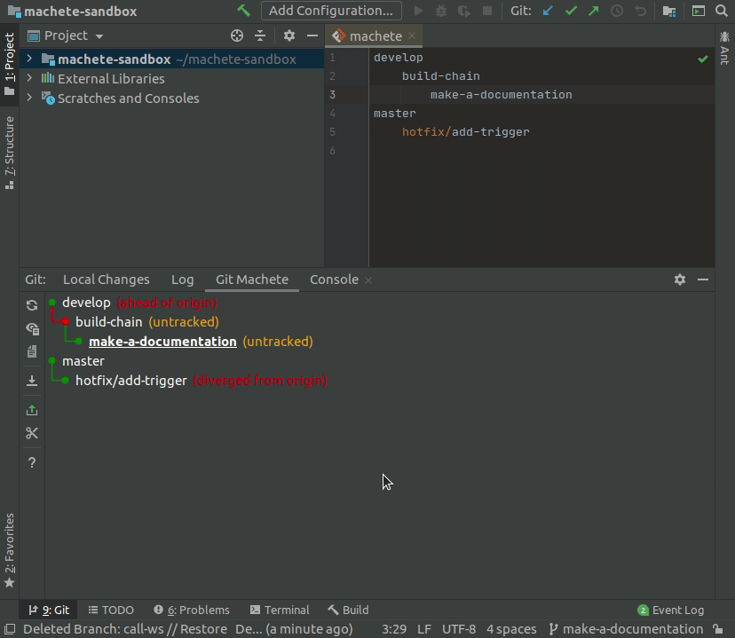

# Git Machete IntelliJ Plugin

[](https://circleci.com/gh/VirtusLab/git-machete-intellij-plugin/tree/master)
[](https://plugins.jetbrains.com/plugin/14221-git-machete)
[](https://plugins.jetbrains.com/plugin/14221-git-machete)


Git Machete plugin is a robust tool that simplifies your git related workflow.
It's a great complement to the JetBrains products' built-in version control system.
The "bird's eye view" provided by Git Machete makes merges/rebases/push/pulls hassle-free
even when multiple branches are present in the repository
(master/develop, your topic branches, teammate's branches checked out for review, etc.).
A look at a Git Machete tab gives an instant answer to the question
"what branches are in this repository, what is going to be merged (rebased/pushed/pulled) and to what?".

With this plugin, you can simply maintain small, focused pull requests that are easy to review.

**It is compatible with all JetBrains products except Android Studio.
The minimum required version is 2020.1**.


See also [git-machete](https://github.com/VirtusLab/git-machete#git-machete) &mdash; CLI version of this plugin.


## Installing

### Install from JetBrains Marketplace

This plugin is available on [JetBrains Marketplace](https://plugins.jetbrains.com/plugin/14221-git-machete). <br/>
To install this plugin go to `File` -> `Settings` -> `Plugins`, then make sure you are on `Marketplace` tab (not `Installed`), in search box type `Git Machete` and click `Install`.
After installation depending on IDE version restart may be required.
In that case, just click `Restart IDE` and confirm that action in a message box.


## How it works

Git Machete IntelliJ Plugin is a port of a great console tool &mdash; [git-machete](https://github.com/VirtusLab/git-machete#git-machete), into an IntelliJ plugin.
Git Machete can help you manage your repository branches and keep it in sync with each other and its counterparts on a remote repository.
Let's see how this plugin can help you:

<details>
<summary><strong>Where to find the plugin tab</strong></summary>
<br/>

Git Machete IntelliJ Plugin is available under `Git` (`VCS` in older IntelliJ versions) tool window in the `Git Machete` tab.
You can also use `Ctrl` + `Alt` + `Shift` + `M` shortcut to open it.


</details>

<details>
<summary><strong>Discover</strong></summary>
<br/>

`machete` file describes relations between branches in your repository (these relations are probably determined by order of branch creation &mdash; which branch from which &mdash; but this is not a rule).
It's located inside the `.git` directory in your repo.

This branch layout can be automatically discovered based on the state of your git repository by `Discover Branch Layout` action.
It constructs a layout from around 10 most recently used branches.
This action is proposed in Git Machete tab in case of empty or nonexistent `machete` file,
but you can also run it any time you want from IntelliJ's `Search Everywhere` (double Shift) by typing `Discover Branch Layout`.


</details>

<details>
<summary><strong>Edit machete file</strong></summary>
<br/>

`machete` file can be also edited manually. Let's look at the structure of this file based on the example below:
```
develop
    allow-ownership-link PR #123
        build-chain PR #124
    call-ws
master
    hotfix/add-trigger
```
`develop`, `allow-ownership-link`, `build-chain`, `call-ws`, `master` and `hotfix/add-trigger` are branch names.
Two of them, `allow-ownership-link` and `build-chain`, have a custom annotation -
it's an arbitrary description displayed next to the given branch (in this case, pull request numbers).

The relation between these branches is determined by indentations &mdash; here single indent is 4 spaces, but a tab can be used as well.

In the example above branches `allow-ownership-link` and `call-ws` are children of `develop` and `build-chain` is a child of `allow-ownership-link`.
The same for `hotfix/add-trigger` and `master` &mdash; the former is a child of the latter.
`develop` and `master` are root branches.

When branch layout is created, Git Machete indicates a relation between parent branch and each of its child branches.
If the edge between them is green that means child branch is in sync with its parent branch &mdash; in other words, there are no commits in parent branch that don't belong to the child.
But if there are some commits in the parent branch that are **not** reachable from the child, then the edge is red &mdash; you need to [rebase](#rebase) child branch onto the parent.

Machete file editor will help you to manage `machete` file: it underlines any errors (bad indentation or nonexistent branches) and proposes branch names based on local repository branches.
When file editing is done, you can click the button in the top right corner of the file editor to refresh the machete branch layout.


For more information about a `machete` file look at the [reference blog post](https://medium.com/virtuslab/make-your-way-through-the-git-rebase-jungle-with-git-machete-e2ed4dbacd02).
</details>

<details>
<summary><strong>Check out branches</strong></summary>
<br/>

With Git Machete you can easily check out branches that have been defined in `machete` file.
Just right-click on the branch you want to check out and select `Checkout Branch`.
You can also double-click on the selected branch to check it out.
The current branch is underlined in a branch layout.


</details>

<details>
<summary><strong>Listing commits</strong></summary>
<br/>

Git Machete can display commits belonging to the branches.
It displays only the commits that are unique to the selected branch (i.e. have never been a tip of a different branch).
When you click on the eye button on the left side of the plugin, you can toggle between showing and hiding commits.


</details>

<details>
<summary><strong>Rebase</strong></summary>
<br/>

Rebase with Git Machete plugin is easy!
Just right-click on the child branch and from a context menu select `(Checkout and) Rebase Branch onto Parent`.
Standard IntelliJ dialog for interactive rebase will appear.


</details>

<details>
<summary><strong>Push</strong></summary>
<br/>

After a rebase, you might want to push the rebased branch to the remote.
Right-click on the given branch and select `Push (Current) Branch` from a context menu.
Push dialog will appear with a proper push button (regular push or force push) depending on which of them is needed.
Basically, you need force push in a case when you rebased our branch because local and remote branch diverged from each other (they have different commits), so git won't let us do a regular push.


</details>

<details>
<summary><strong>Pull</strong></summary>
<br/>

If a branch is behind (or in sync with) its remote, it can be pulled.
To do this, right-click on a given branch and select `Pull Branch`.
This action does `--ff-only` pull only which is enough in this case.


</details>

<details>
<summary><strong>Reset to remote</strong></summary>
<br/>

If a given branch is not in sync with its remote, you can reset it to point to the exact same commit as the remote.
From a right-click context menu select `Checkout and Reset Branch to Remote`.
This action performs `git reset --keep` under the hood. `--keep`, as opposed to `--hard`, keeps your uncommitted changes safe from getting overwritten.


</details>

<details>
<summary><strong>Fast forward parent</strong></summary>
<br/>

When you are done with the changes on the selected branch (e.g. PR was approved and all required fixes are applied), you probably want to merge this branch to its parent branch.
When these branches are in sync (green edge) you can do a fast forward merge.
Fast forward merge is just equivalent to moving tip of a branch to which you merge to the same commit as a tip of a merged branch.
This is what `Fast Forward Parent Branch To Match Current Branch` context menu action does.
As you can see, the edge between a given branch and its parent was changed to grey &mdash; it means that the child branch has been merged.


</details>

<details>
<summary><strong>Slide out branch</strong></summary>
<br/>

When a branch was merged (and sometimes in other cases as well), you probably want to remove this branch from branch layout.
To do this with ease (and without manual editing of `machete` file) you can use `Slide Out Selected Branch` action.
This action will modify the branch layout, removing the entry for the selected branch `X` and reattaching `X`'s children as new children of `X`'s parent.
If `machete.slideOut.deleteLocalBranch` git configuration key is set to `true`, then this action will also delete `X` branch from the underlying git repository (and not just from `.git/machete` file).
The easiest way to set this key is using `git config --add machete.slideOut.deleteLocalBranch true` command inside a given repository.
If you want to set this key globally (to be used for all repositories that don't have this key set explicitly), add `--global` option to the previous command.


</details>

<details>
<summary><strong>Slide in branch</strong></summary>
<br/>

You can also create a new branch below selected one (also without editing `machete` file manually).
To do this, choose the `Slide In Branch Below Selected Branch` action from a context menu.
Type the name of new branch in the dialog window and click `Slide In` button.
Another dialog will appear &mdash; it is a standard new branch IntelliJ dialog.


A slide in action can also add a branch that already exists in git repository to the branch layout.
Again, select the `Slide In Branch Bellow Selected Branch` from a context menu and type the name of an already existing branch.



This action can also be used to reattach an existing branch below a selected one.
In this case, you just must type a name of the existing branch that you want to reattach and then click `Slide In`.
You can also select the `Reattach children` checkbox to move along all children of the reattached branch.


</details>

<details>
<summary><strong>Override fork point</strong></summary>
<br/>

If one of branch layout edges is yellow, that means the fork point of this branch cannot be unambiguously determined.
However, Git Machete can give you a hit which of a commit is probably a fork point.
Show commits to see this one (see the `Listing commits` section).

Now you can use `Override Fork Point of Branch` action to choose the fork point of this branch.
It can be commit inferred by Git Machete (the one marked in commits list), or the one that parent branch is pointing to.


</details>

<details>
<summary><strong>Other actions</strong></summary>
<br/>

On the left side bar you can find other actions (from top to bottom):
-  **Refresh Status** &mdash; refreshing (reload) branch layout (the graph displayed in main plugin window)
-  **Toggle Listing Commits** &mdash; show or hide commits belonging to branches (for more details see section [Listing commits](#listing-commits))
-  **Open Machete File** &mdash; open `machete` file in IntelliJ editor (to see what this editor can do see [Machete file editor](#machete-file-editor) section)
-  **Fetch All Remotes** &mdash; equivalent of `git fetch --all` command
- The most suitable action (each is equivalent of context menu actions) for a current branch that can be one of:
    -  **Push Current Branch**
    -  **Pull Current Branch**
    -  **Reset Current Branch to Remote**
    -  **Slide Out Current Branch**
    -  **Rebase Current Branch Onto Parent**
    -  **Override Fork Point of Current Branch**

  Available action is selected based on a relation between a current branch and its parent and remote branch.
-  **Slide In Branch Below Current Branch** &mdash; shortcut of [slide in](#slide-in-branch) action for current branch
-  **Show Help Window** &mdash; show window with example branch layout and explanation what parts of this graph mean
</details>

<details>
<summary><strong>Multi-repository support</strong></summary>
<br/>

Git Machete supports many git repositories in one project, including both regular repositories and submodules.
If more than one repository is detected, the selection list will appear in the top of a main plugin window.
In that case, each repository will have its own `machete` file.


</details>

## Build

<details>
<summary><strong>Prerequisites</strong></summary>
<br/>

* git
* latest 2020.1 Community Edition/Ultimate

  * Install [Lombok plugin](https://plugins.jetbrains.com/plugin/6317-lombok/)
  * Enable annotation processing (for Lombok):
    `File` -> `Settings` -> `Build`, `Execution`, `Deployment` -> `Compiler` -> `Annotation Processors` -> `Enable Annotation Processing`
  * Set Project SDK to JDK 11: `Project Structure` -> `Project`

Consider increasing maximum heap size for the IDE (the default value is 2048 MB) under `Help` -> `Change Memory Settings`.

For running `./gradlew` from the command line, make sure that `java` and `javac` are in `PATH` and point to Java 11.
</details>

<details>
<summary><strong>Compilation</strong></summary>
<br/>

To compile the project, run `./gradlew build`.

Currently, very generous maximum heap size options are applied for Gradle's Java compilation tasks (search for `-Xmx` in [build.gradle](build.gradle)). <br/>
To overwrite them, use `compileJavaJvmArgs` Gradle project property
(e.g. `./gradlew -PcompileJavaJvmArgs='-Xmx2g -XX:+HeapDumpOnOutOfMemoryError' build`,
or equivalently with an env var: `ORG_GRADLE_PROJECT_compileJavaJvmArgs='-Xmx2g -XX:+HeapDumpOnOutOfMemoryError' ./gradlew compileJava`).

By default, Lombok's annotation processor runs on the fly and Delomboked sources are not saved to {subproject}/build/delombok/...<br/>
To enable Delombok, set `useDelombok` Gradle project property (e.g. `./gradlew -PuseDelombok build`).

In case of spurious cache-related issues with Gradle build, try one of the following:
* `./gradlew --stop` to shut down gradle daemon
* `./gradlew clean` and re-run the failing `./gradlew` command with `--no-build-cache`
* remove .gradle/ directory in the project directory
* remove ~/.gradle/caches/ (or even the entire ~/.gradle/) directory
</details>

<details>
<summary><strong>Generate plugin zip</strong></summary>
<br/>

To generate a plugin archive run `:buildPlugin` Gradle task (`Gradle panel` -> `Tasks` -> `intellij` -> `buildPlugin` or `./gradlew buildPlugin`).<br/>
The resulting file will be available under `build/distributions/`.
</details>

## Issue reporting

If you see any bug or just would like to propose any new feature, feel free to create an issue.
When you report a bug please include logs from IntelliJ.<br/>
It can be very helpful for us to enable logging on a debug level and then reproduce a bug.
To do this, go to `Help` -> `Diagnostic Tools` -> `Debug Log Settings` and then paste the following lines:

```
binding
branchlayout
gitcore
gitmachete.backend
gitmachete.frontend.actions
gitmachete.frontend.externalsystem
gitmachete.frontend.graph
gitmachete.frontend.ui
```

Then reproduce the bug and go to `Help` -> `Show Log in Files` to open the log file.

## Development

For more details on development of the project, see the [guideline](DEVELOPMENT.md).
