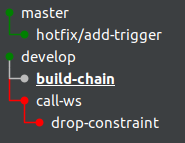
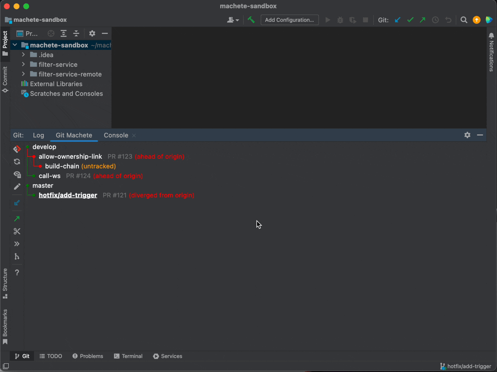
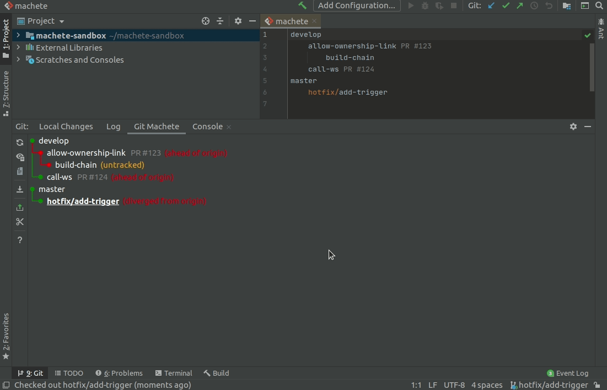
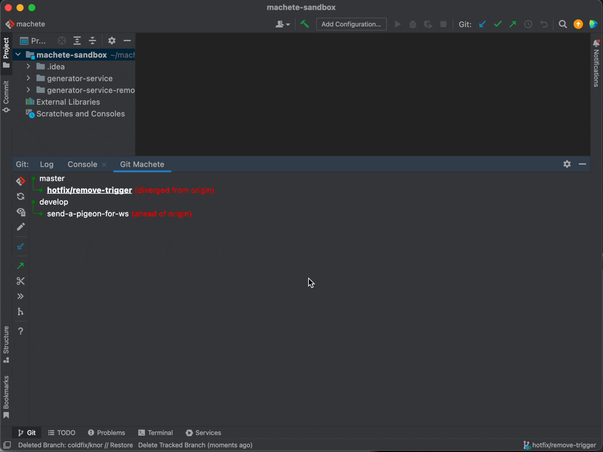

# Git Machete IntelliJ Plugin

[](https://circleci.com/gh/VirtusLab/git-machete-intellij-plugin/tree/master)
[](https://plugins.jetbrains.com/plugin/14221-git-machete)
[](https://plugins.jetbrains.com/plugin/14221-git-machete)


Git Machete plugin is a robust tool that **simplifies your git related workflow**.
It's a great complement to the JetBrains products' built-in version control system.<br/>

The _bird's eye view_ provided by Git Machete makes **merges/rebases/push/pulls hassle-free**
even when **multiple branches** are present in the repository
(master/develop, your topic branches, teammate's branches checked out for review, etc.).<br/>

A look at a Git Machete tab gives an instant answer to the questions:
* What branches are in this repository?
* What is going to be merged (rebased/pushed/pulled) and to what?

With this plugin, you can maintain **small, focused, easy-to-review pull requests** with little effort.

**It is compatible with all JetBrains products except Android Studio.
The minimum required version is 2020.1**.

Git Machete IntelliJ Plugin is a port of a handy console tool &mdash; [git-machete](https://github.com/VirtusLab/git-machete#git-machete), into an IntelliJ plugin.


# Table of Contents

<!-- START doctoc generated TOC please keep comment here to allow auto update -->
<!-- DON'T EDIT THIS SECTION, INSTEAD RE-RUN doctoc TO UPDATE -->
<!-- To install doctoc run `npm install -g doctoc`, to use it run `doctoc <this-file-path> -->

- [Installing from JetBrains Marketplace](#installing-from-jetbrains-marketplace)
- [Getting started with Git Machete](#getting-started-with-git-machete)
    - [Where to find the plugin tab](#where-to-find-the-plugin-tab)
  - [Branch graph](#branch-graph)
  - [Check out branches](#check-out-branches)
  - [Rebase](#rebase)
  - [Discover](#discover)
- [Feature List](#feature-list)
- [Build](#build)
- [Issue reporting](#issue-reporting)
- [References](#references)

<!-- END doctoc generated TOC please keep comment here to allow auto update -->


## Installing from JetBrains Marketplace

This plugin is available on [JetBrains Marketplace](https://plugins.jetbrains.com/plugin/14221-git-machete). <br/>
To install this plugin go to `File` -> `Settings` -> `Plugins` in your IDE,
then make sure you are on `Marketplace` tab (not `Installed`), in search box type `Git Machete` and click `Install`.
After installation, depending on the IDE version the restart may be required.
In that case, just click `Restart IDE` and confirm that action in a message box.

## Getting started with Git Machete


The examples below show a few common situations where Git Machete finds an exceptional application.
If you are a Git Master or have used the CLI version already, you may want to jump directly to the [feature list](FEATURE-LIST.md).

<TODO: EXAMPLES PLACEHOLDER>

#### Where to find the plugin tab

Git Machete IntelliJ Plugin is available under the `Git` tool window in the `Git Machete` tab.
You can also use `Ctrl + Alt + Shift + M` shortcut to open it.


### Branch graph

For each branch, Git Machete indicates the relation to each of its child branches.
If the edge between them is **green** that means the child branch is in sync with its parent branch &mdash; in other words, there are no commits in the parent branch that don't belong to the child.
But if there are some commits in the parent branch that are **not** reachable from the child, then the edge is **red** &mdash; you need to [rebase](#rebase) the child branch onto the parent.
The **gray** color of the edge means that the branch was merged to the parent.
In some (rare) cases you may encounter a **yellow** edge which means that a fork point can't be determined automatically
(see [Override fork point section](#override-fork-point) to learn how to fix that).



As we can see in the example above, `hotfix/add-trigger` is in sync with `master`.
`call-ws` is **not** in sync with `develop` and `drop-constraint` is **not** in sync with `call-ws`.
`build-chain` was merged into `develop`.
Note that the branch layout can be arbitrarily modified with ease (see [Edit machete file section](#edit-machete-file) for details).


### Check out branches

With the Git Machete you can easily check out branches that have been defined in the `machete` file.
Just right-click on the branch you want to check out and select `Checkout`.
You can also double-click on the selected branch to check it out.
The current branch is underlined in a branch layout.




### Rebase

Rebase with Git Machete plugin is easy!
Just right-click on the child branch and from a context menu select `(Checkout and) Rebase Branch onto Parent`.
Standard IntelliJ dialog for interactive rebase will appear.




### Discover

The `machete` file describes relations between branches in your repository.
These relations are probably determined by the order of branch creation &mdash;
which branch has been created from which &mdash; but this is not a strict rule).<br/>
It'll be located under `.git/machete` path in your repository.

This branch layout can be automatically discovered based on the state of your git repository by the `Discover Branch Layout` action.
It constructs a layout from around 10 most recently used branches.
**This action is automatically invoked in case of an empty or nonexistent `machete` file,**
but you can also run it any time from IntelliJ's `Search Everywhere` (double Shift) by typing `Discover Branch Layout`.




## Feature List

Please see the [feature list](FEATURE-LIST.md) for more specific features description.


## Build

Please see the [development documentation](DEVELOPMENT.md) for instruction on how to build this plugin on your own.


## Issue reporting

If you see any bug or just would like to propose any new feature, feel free to create an issue.
When you report a bug please include logs from IntelliJ.<br/>
It can be very helpful for us to enable logging on a debug level and then reproduce a bug.
To do this, go to `Help` -> `Diagnostic Tools` -> `Debug Log Settings` and then paste the following lines:

```
binding
branchlayout
gitcore
gitmachete.backend
gitmachete.frontend.actions
gitmachete.frontend.externalsystem
gitmachete.frontend.graph
gitmachete.frontend.ui
```

Then reproduce the bug and go to `Help` -> `Show Log in Files` to open the log file.


## References

See also [git-machete](https://github.com/VirtusLab/git-machete#git-machete) &mdash; a CLI version of this plugin.

For more information about the `git machete`, look at the [reference blog post](https://medium.com/virtuslab/make-your-way-through-the-git-rebase-jungle-with-git-machete-e2ed4dbacd02).
