# Git Machete Features

## Where to find the plugin tab

Git Machete IntelliJ Plugin is available under the `Git` tool window in the `Git Machete` tab.
You can also use `Ctrl + Alt + Shift + M` shortcut to open it.

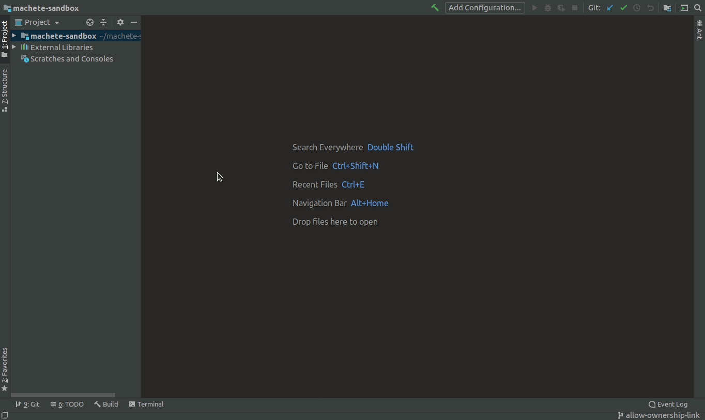


## Branch layout graph

For each branch, Git Machete indicates the syncToRemoteStatus to each of its child branches.
If the edge between them is **green** that means the child branch is in sync with its parent branch &mdash; in other words, there are no commits in the parent branch that don't belong to the child.
But if there are some commits in the parent branch that are **not** reachable from the child, then the edge is **red** &mdash; you need to [rebase](#rebase) the child branch onto the parent.
The **gray** color of the edge means that the branch was merged to the parent.
In some (rare) cases you may encounter a **yellow** edge which means that a fork point can't be determined automatically
(see [Override fork point section](#override-fork-point) to learn how to fix that).


As we can see in the example above, `hotfix/add-trigger` is in sync with `master`.
`call-ws` is **not** in sync with `develop` and `drop-constraint` is **not** in sync with `call-ws`.
`build-chain` was merged into `develop`.
Note that the branch layout can be arbitrarily modified with ease (see [Edit machete file section](#edit-machete-file) for details).


## Check out branches

With the Git Machete you can easily check out branches that have been defined in the `machete` file.
Just right-click on the branch you want to check out and select `Checkout`.
You can also double-click on the selected branch to check it out.
The current branch is underlined in a branch layout.


## Toggle listing commits

Git Machete can display commits belonging to the branches.
It displays only the commits that are unique to the selected branch (i.e. have never been a tip of a different branch).
When you click on the eye button on the left side of the plugin, you can toggle between showing and hiding commits.

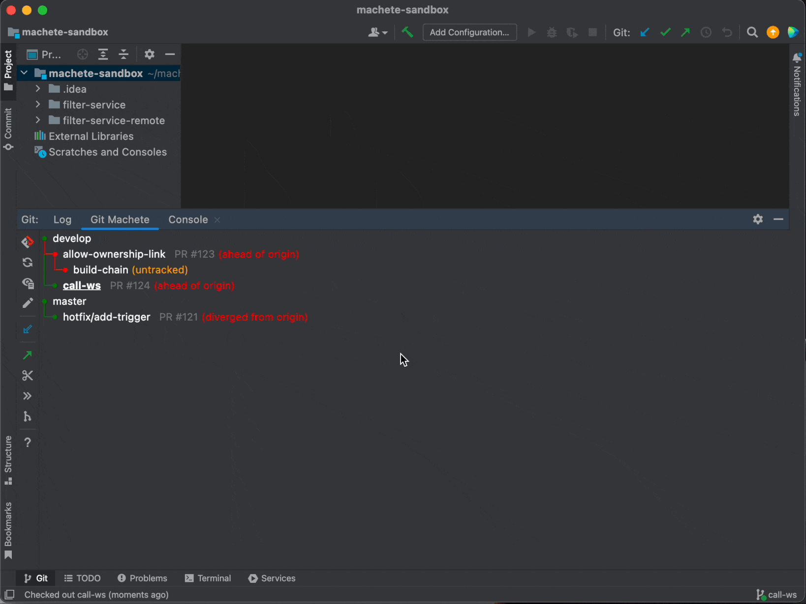


## Rebase

Rebase with Git Machete plugin is easy!
Just right-click on the child branch and from a context menu select `(Checkout and) Rebase Branch onto Parent`.
Standard IntelliJ dialog for interactive rebase will appear.


## Push

After a rebase, you might want to push the rebased branch to the remote.
Right-click on the given branch and select `Push...` from a context menu.
Push dialog will appear with a proper push button (regular push or force push) depending on which of them is needed.
Basically, you need a force push in a case when you rebased your branch and thus local and remote branch diverged from each other (they have different commits), so git won't let you do a regular push.
Note that the dialog allows for selecting the target remote to push (just like the usual push dialog).

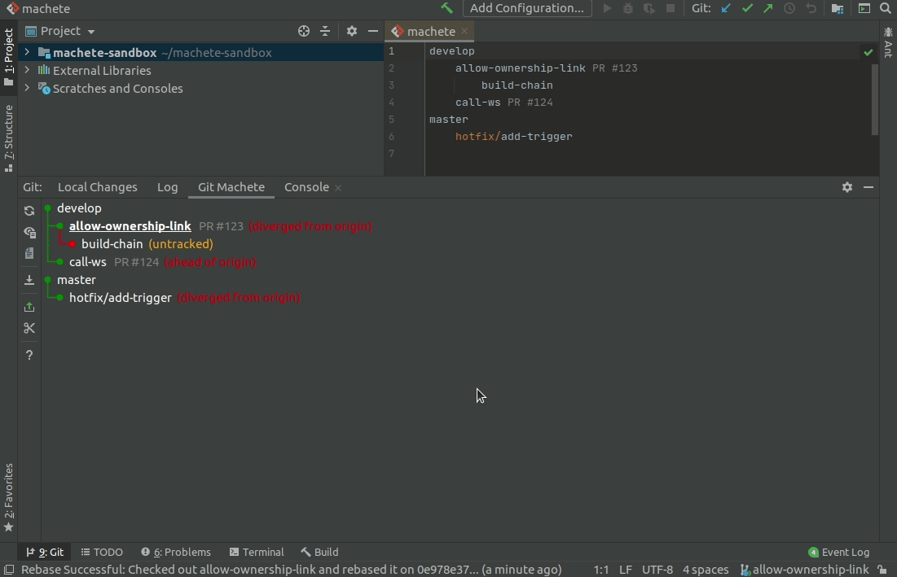


## Pull

If a branch is behind (or in sync with) its remote, it can be pulled.
To do this, right-click on a given branch and select `Pull`.<br/>
This action always performs a `--ff-only` (fast-forward only) pull which makes handling diverged remote branches less error-prone.


## Reset to remote

If a given branch is not in sync with its remote, you can reset it to point to the exact same commit as the remote.
From the right-click context menu, select `Reset Branch to Remote`.<br/>
When resetting the current branch, this action performs `git reset --keep` under the hood.
The `--keep` option, as opposed to `--hard`, keeps your uncommitted changes safe from getting overwritten.

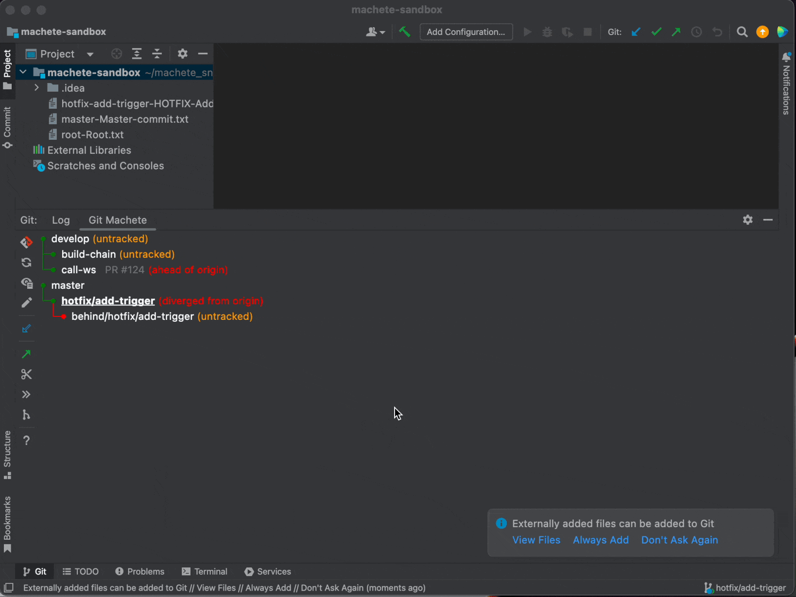


## Fast-forward merge to parent

When you are done with the changes on the selected branch (e.g. PR has been approved and all required fixes are applied),
you probably want to merge this branch to its parent branch.
When these branches are in sync (green edge), you can do a fast-forward merge.
Fast-forward merge is just equivalent to moving the tip of a branch to which you merge (`develop` in the sample below)
to the same commit as a tip of a merged branch (`call-ws` below).
This is what `Fast-forward Merge To Parent` context menu action does.
As you can see, the edge between `develop` and `call-ws` changed to grey &mdash; it means that `call-ws` has been merged.

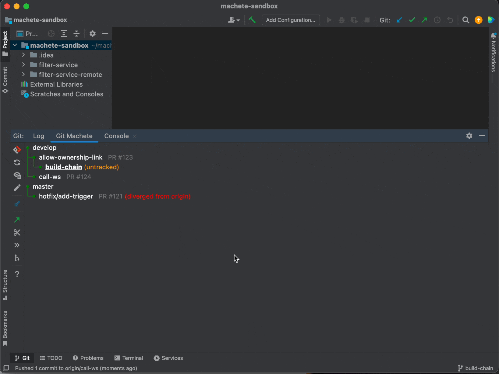


## Slide out branch

When a branch was merged (and sometimes in other cases as well), you probably want to remove this branch from the branch layout.
To do this with ease (and without editing the `machete` file manually), you can use the `Slide Out` action.
This action will modify the branch layout, removing the entry for the selected branch `X` and reattaching `X`'s children as new children of `X`'s parent.<br/>

If `machete.slideOut.deleteLocalBranch` git configuration key is set to `true`, then this action will also delete `X` branch from the underlying git repository (and not just from `.git/machete` file).
The easiest way to set this key is using `git config --add machete.slideOut.deleteLocalBranch true` command inside a given repository.
If you want to set this key globally (to be used for all repositories that don't have this key set explicitly), add `--global` option to the previous command.

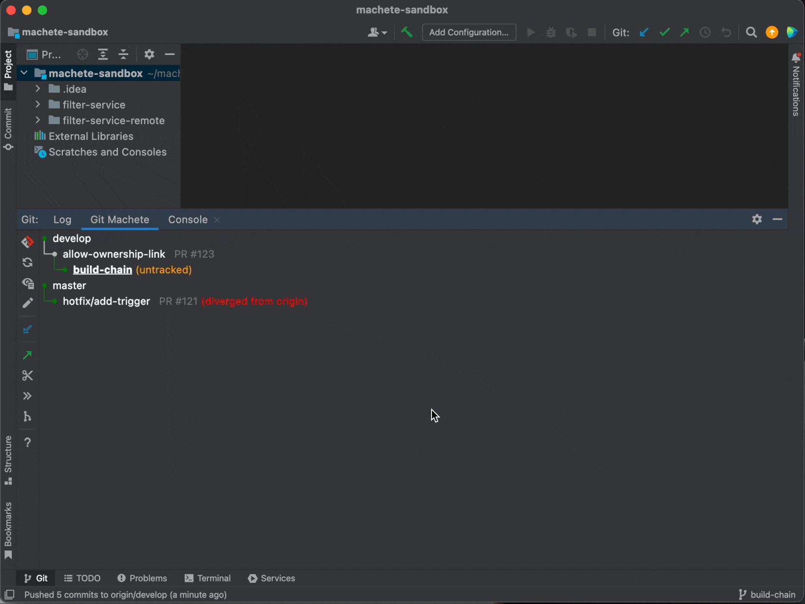

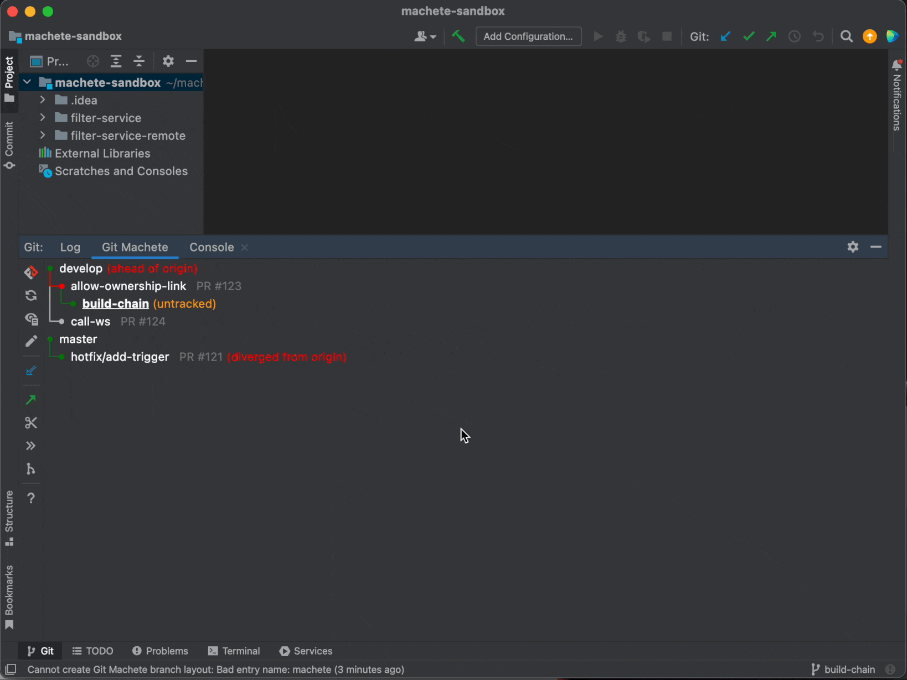


## Slide in branch

You can also create a new branch below the selected one (also without editing the `machete` file manually).
To do this, choose the `Slide In Branch Below...` action from a context menu.
Type the name of a new branch in the dialog window and click the `Slide In` button.
Another dialog will appear &mdash; it is a standard new branch IntelliJ dialog.

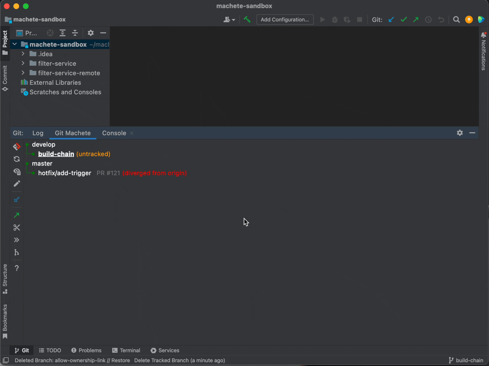

A slide in action can also add a branch that already exists in the git repository to the branch layout.
Again, select the `Slide In Branch Below...` from a context menu and type the name of an already existing branch.

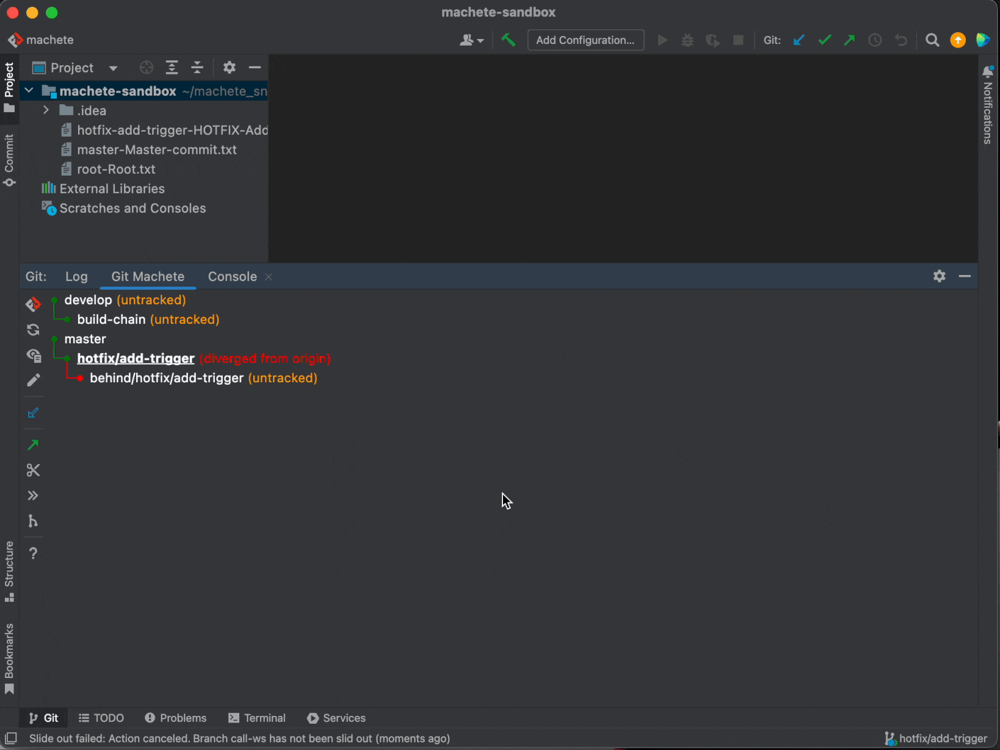

This action can also be used to reattach an existing branch below a selected one.
In this case, just type the name of the existing branch that you want to reattach and then click `Slide In`.
You can also select the `Reattach children` checkbox to move along all children of the reattached branch.

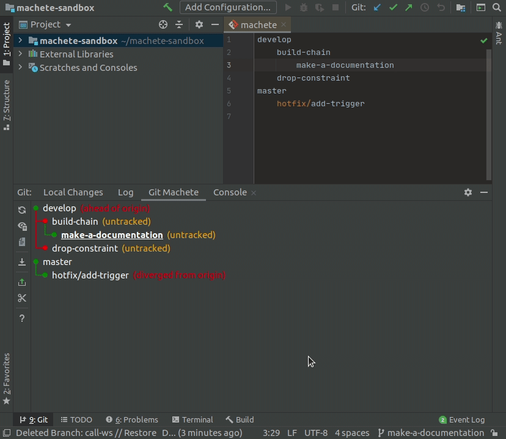

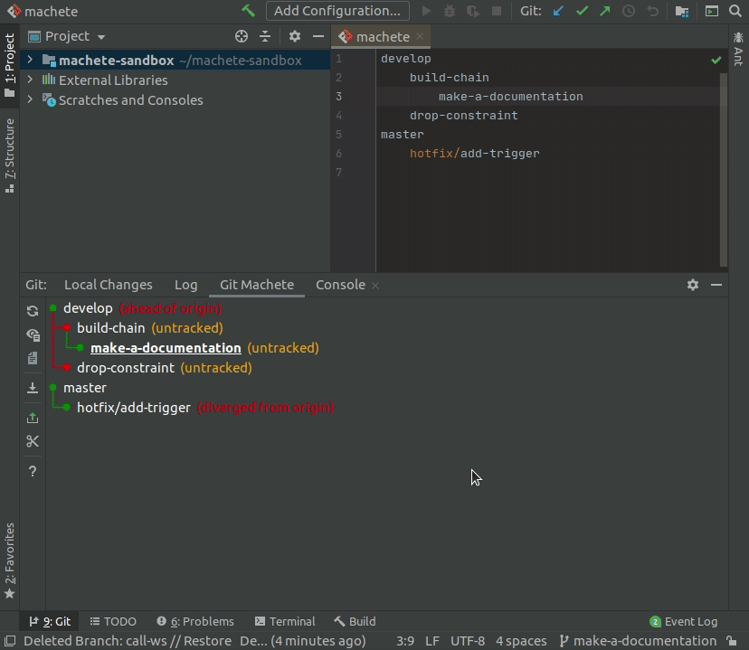


## Override fork point

Similarly as defined in [git merge-base documentation](https://git-scm.com/docs/git-merge-base#Documentation/git-merge-base.txt---fork-point),
we define **fork point** of a given branch `X` as the commit at which `X` forks from any other branch.
The commits from the fork point (exclusive) to the tip of the branch (inclusive) are unique to this branch &mdash;
this is what Git Machete displays when [toggle listing commits](#toggle-listing-commits) is enabled.

If one of the branch layout edges is yellow, that means the fork point of this branch cannot be unambiguously determined.
In the sample below, the downstream branch (`call-ws`) is still in sync with the upstream (`develop`),
but the upstream branch tip isn't the fork point of the downstream branch.

Translating from git-ese to English, there are probably commits from some other branches on the way between `develop` and `call-ws`.
You won't come across the yellow edges very often in day-to-day work with git machete
&mdash; it mostly happens when the branch layout has been surgically modified.

However, Git Machete can give you a hint which commit is probably the fork point.
Show commits to see the suggested fork point (see the [toggle listing commits](#toggle-listing-commits) section).

Now you can use the `Override Fork Point...` action to choose the fork point of this branch.
It can be the commit inferred by Git Machete (the one marked in commits list), or the one that the parent branch is pointing to.

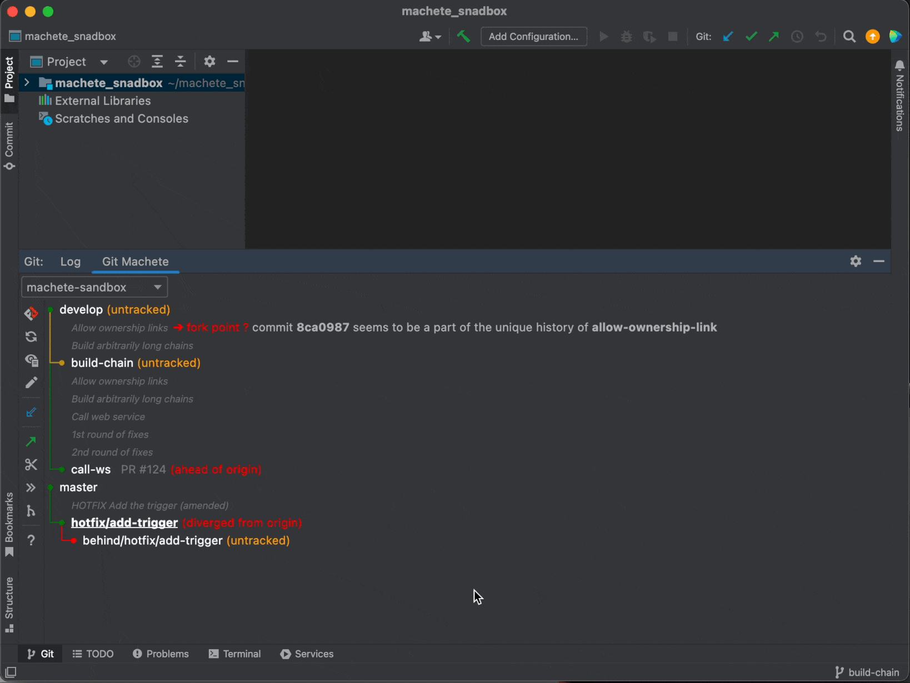


## Discover

The `machete` file describes relations between branches in your repository.
These relations are probably determined by the order of branch creation &mdash;
which branch has been created from which &mdash; but this is not a strict rule.<br/>
It'll be located under `.git/machete` path in your repository.

This branch layout can be automatically discovered based on the state of your git repository by the `Discover Branch Layout` action.
It constructs a layout from around 10 most recently used branches.
**This action is automatically invoked in case of an empty or nonexistent `machete` file,**
but you can also run it any time from IntelliJ's `Search Everywhere` (double Shift) by typing `Discover Branch Layout`.


## Edit machete file

The `machete` file can be also edited manually. Let's look at the structure of this file based on the example below:
```
develop
    allow-ownership-link PR #123
        build-chain
    call-ws PR #124
master
    hotfix/add-trigger
```
`develop`, `allow-ownership-link`, `build-chain`, `call-ws`, `master` and `hotfix/add-trigger` are branch names.
Two of them, `allow-ownership-link` and `call-ws`, have a custom annotation &mdash;
it's an arbitrary description displayed next to the given branch (in this case, pull request numbers).

The syncToRemoteStatus between these branches is determined by indentations &mdash; here single indent is 4 spaces, but a tab can be used as well.

In the example above, branches `allow-ownership-link` and `call-ws` are children of `develop`, while `build-chain` is a child of `allow-ownership-link`. <br/>
`master`, in turn, is the parent of `hotfix/add-trigger`. <br/>
`develop` and `master` are root branches.

Machete file editor will help you with managing the `machete` file: it underlines any errors (bad indentation or nonexistent branches) and proposes branch names based on local repository branches.
When file editing is done, you can click the button in the top right corner of the file editor to refresh the machete branch layout.

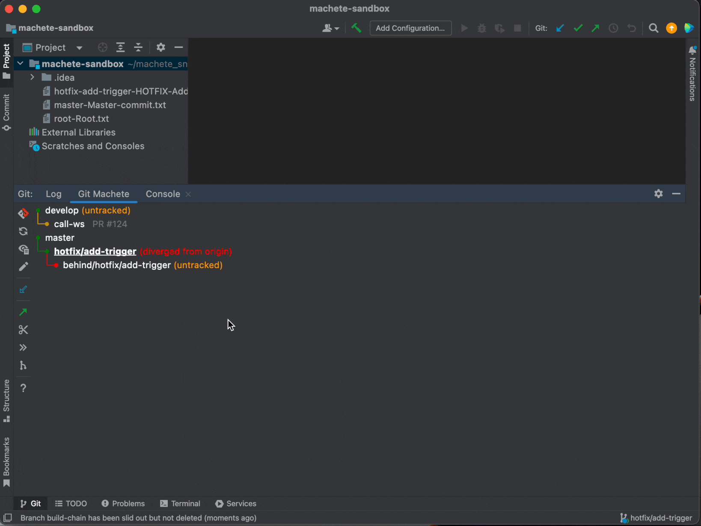

For more information about the `machete` file, look at the [reference blog post](https://medium.com/virtuslab/make-your-way-through-the-git-rebase-jungle-with-git-machete-e2ed4dbacd02).


## Other actions

On the left side bar you can find other actions (from top to bottom):
-  **Refresh Status** &mdash; refresh the graph displayed in main plugin window
-  **Toggle Listing Commits** &mdash; show or hide commits belonging to branches (for more details see `Toggle listing commits` section)
-  **Open Machete File** &mdash; open the `machete` file in IntelliJ editor (to see what this editor can do see `Edit machete file` section)
-  **Fetch All Remotes** &mdash; equivalent to `git fetch --all` command
- The most suitable actions (each is equivalent to one of the context menu actions) for a current branch that include one or more of:
    -  **Push Current Branch**
    -  **Pull Current Branch**
    -  **Reset Current Branch to Remote**
    -  **Slide Out Current Branch**
    -  **Rebase Current Branch Onto Parent**
    -  **Override Fork Point of Current Branch**

  Available action is selected based on a syncToRemoteStatus between a current branch and its parent and remote branch.
-  **Slide In Branch Below Current Branch** &mdash; shortcut of [slide in](#slide-in-branch) action for current branch
-  **Show Help Window** &mdash; show window with a sample branch layout and explanation what parts of this graph mean


## Multi-repository support

Git Machete supports many git repositories in one project, including both regular repositories and submodules.
If more than one repository is detected, the selection list will appear at the top of the main plugin window.
In that case, each repository will have its own `machete` file.

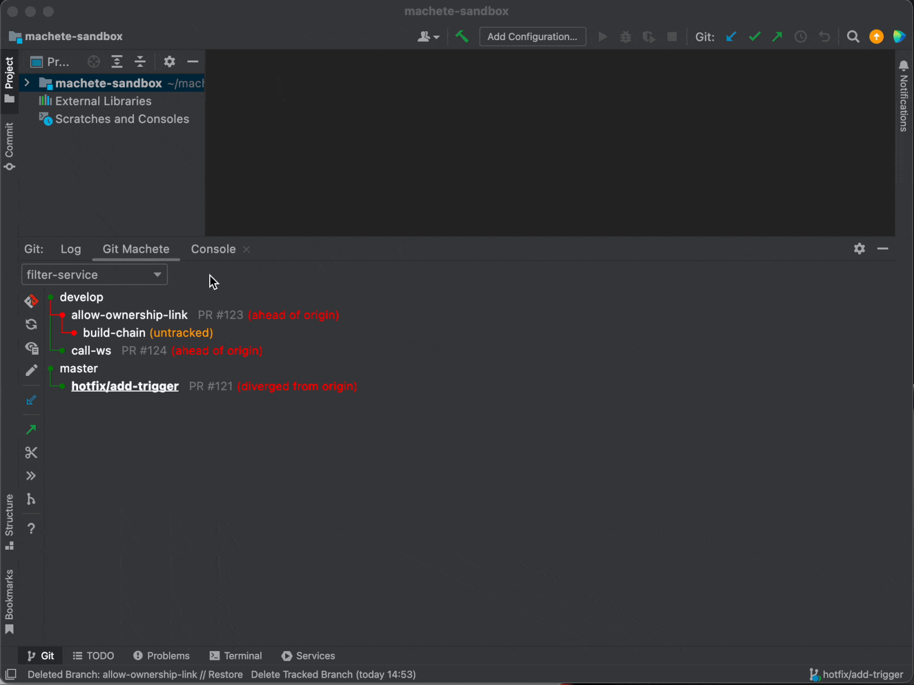
