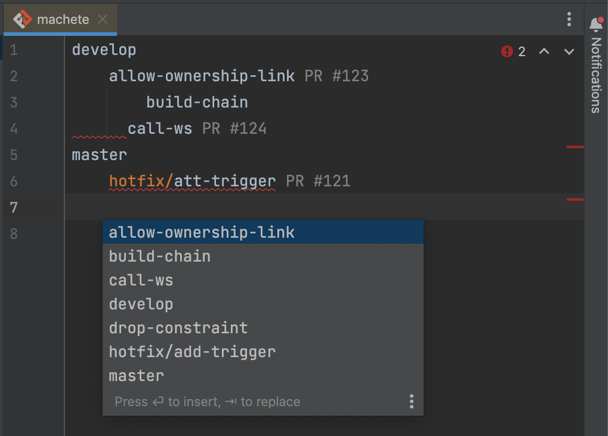
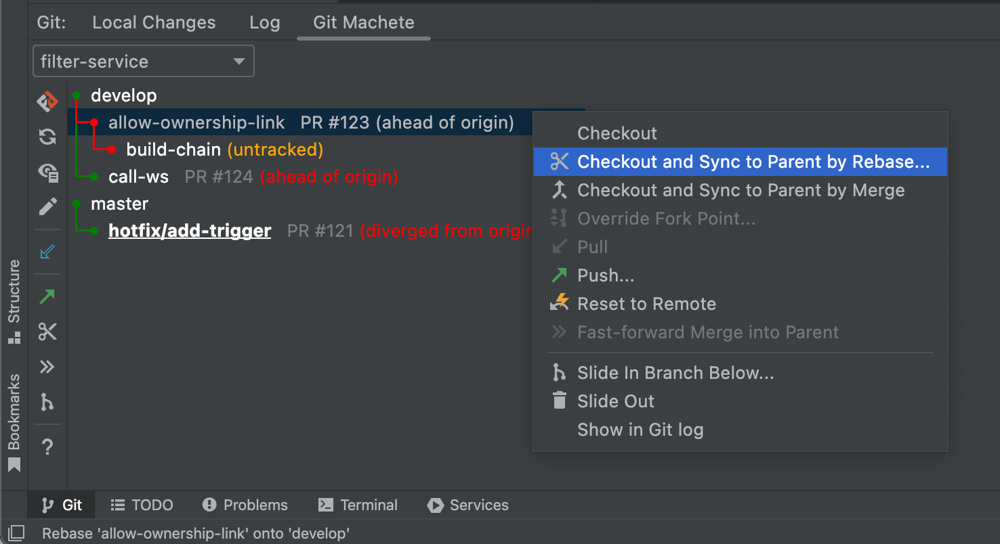
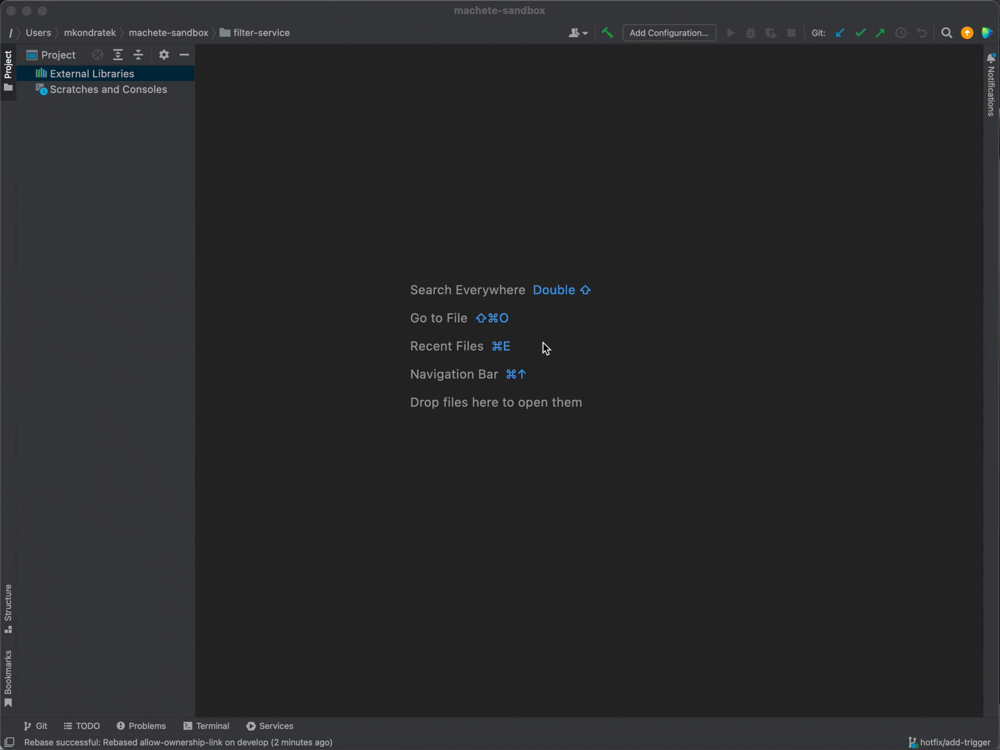
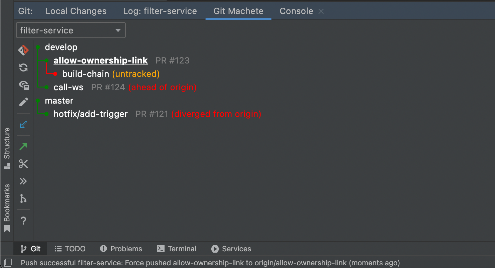

## Take a look at your repository from a new perspective with Git Machete Plugin!

Creating and maintaining small, focused, easy-to-review PRs is a comfortable and desired approach
for both the authors and, especially, the reviewers.
We created a plugin that eases the management of 2+ branches in the repository
while also promoting the creation of small PRs &mdash;
**a git repository organizer and a rebase/merge/push/pull automation tool, named Git Machete.**

It allows for looking at the state of the repository from a previously unknown perspective.
It puts the primary focus on branches (rather than commits),
their relationship with each other and with the remote repository.
It finds an outstanding application in maintaining linear Git history.

### Git Machete Status Graph

The picture above presents the demo repository `filter-service` with a few branches.
It contains two **root branches** &mdash; `develop` and `master`.
The first of them has two **child branches** &mdash; `allow-ownership-link`
(with a child branch of its own &mdash; `build-chain`), and `call-ws`.

Each line contains a name of a branch, an optional custom annotation, and a relation to the remote branch.

Without going into details, the **green edge** indicates the desired state &mdash;
the tip of the child branch is a direct descendant of the parent branch tip
(i.e. all commits reachable from the parent are also reachable from the child). 
On the other hand, the **red edge** tells us the opposite &mdash;
the tip of the child branch is **not** a direct descendant of the parent branch tip.

In most cases, an edge becomes red after committing some changes to the parent branch (review fixes)
or pulling new commits to the parent from a remote.

### Machete File

The branches presented within the graph are defined in a simple configuration file (`.git/machete`),
which can be easily opened from the plugin's toolbar.
It supports both syntax highlighting and completion of local branch names.
The graph is automatically refreshed when `.git/machete` is modified.

Bear in mind that there is no need to edit the machete file manually to set up your branch layout tree.
Feel free to use `Discover Branch Layout` functionality that will find it out for you automatically.
It can be performed from the toolbar - it is a first action (with Git Machete logo).
Furthermore, the discovery happens in the case of a missing or empty machete file
(although the discovered layout might require some manual changes).

### Lights, Camera... Actions

The plugin provides a bunch of actions that can help you to manage your repository.

Among the others, there is `Sync by Rebase`
(that performs interactive rebase of a given branch onto its parent), `Sync by Merge`, `Push` and `Pull`.
Let's have a look at the following example...

Branch `allow-ownership-link` is **out of sync** (red edge) to its parent &mdash; `develop`.
Furthermore, it is **ahead of** its remote branch (`origin/develop`).
With Git Machete we can quickly and conveniently lead it to the desired state.

First, `Checkout and Sync to Parent by Rebase...`.
That will perform an interactive rebase from IntelliJ.
Once the rebase is finished, the branch is **in sync** (green edge) with its parent.

#### VCS Log Rebase

#### Git Machete Rebase

Now all that's left is to `Push...`.
This action opens a (force) push dialog.  
After a successful push, the remote branch is **up to date** with its remote branch.

The final repository status is shown below.

### Try it now

The plugin is available from the [Marketplace](https://plugins.jetbrains.com/plugin/14221-git-machete "JetBrains Marketplace - Git Machete Plugin").  
For additional reference, see the project on [GitHub](https://github.com/VirtusLab/git-machete-intellij-plugin#git-machete-intellij-plugin "GitHub - Git Machete Plugin").
