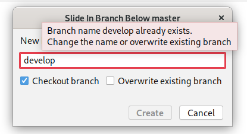
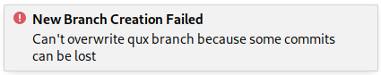

# Overview through Slide In use cases

It turned out that the sliding-in feature is more complex than it had appeared in the first place.
This document is an overview through the use cases.
It should help to implement and understand the feature.

## Slide In Branch Dialog

The picture below shows the **Slide In Branch Dialog**.
This is a regular **Create New Branch Dialog** with a changed title.

Note the checkbox options:
- Checkout branch
- Overwrite existing branch

## Use cases

| UC ID | Local branch exists | Branch entry exists | Estimated frequency |
| :---: | :---: | :---: | :---: |
| 1 | false | false | ~ 75% |
| 2 | false | true  | < 1%  |
| 3 | true  | false | ~ 25% |
| 4 | true  | true  | < 1%  |

## Slide In - Logic

This specification covers all of the cases.

- When the **entry does not exist**, it must be added under the given branch.
- When the **entry exists under the given parent**, branch layout must not be affected.
- When the **entry exists under other parent or is root**, it must be reattached under the given parent.

**IMPORTANT NOTE:**
Sliding in an entry under itself (directly and indirectly, as a deeper child node) must not be allowed.

### Zoom In On "Overwrite existing branch"

This section applies to **UC3** and **UC4**.

The same logic slide in logic adopts but overwriting itself requires a description.
The enabled overwrite checkbox is required for branches that already exist within a local repository.
Without it the overwrite (aka "New Branch Creation") is disabled (gray out "Create" button).

| Branch State | Overwrite Result |
| --- | :---: |
| **Working tree changed** (uncommitted changes) | Fail |
| Branch contains **some commits** | Fail |
| Branch contains **no commits** | Success |

**IMPORTANT NOTE:**
The failure of the overwrite does not mean the failure of the slide in.
Even though the notification like above may appear when the specified circumstances are met the branch slide will take place.
