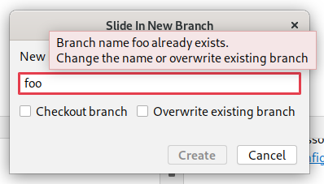

# Overview through Slide In use cases

It turned out that the sliding-in feature is more complex than it had appeared in the first place.
This paper is an overview through the use cases.
It should help to implement and understand the feature.

## Slide In New Branch Dialog

The picture below shows the **Slide In New Branch Dialog**.
This is a regular **Create New Branch Dialog** with a changed title.

Note the checkbox options:
- Checkout branch
- Overwrite existing branch

## Use cases

| UC ID | Branch entry exists | Local branch exists | Estimated frequency |
| :---: | :---: | :---: | :---: |
| 1 | false | false | ~ 75% |
| 2 | false | true | ~ 25% |
| 3 | true | true | < 1% |
| 4 | true | false | < 1% |

## Slide In - Logic

- When the **entry does not exist**, it must be added (slid in) under the given branch.
- When the **entry exists under the given parent**, branch layout must not be affected.
- When the **entry exists under other parent**, it must be first removed (slid out),
and then added (slid in) under the given parent.

## Slide In - New Branches

This section applies to **UC1** and **UC4**.

Use case **UC1** seems to be the most common.
They are simply added in the way specified by the [slide in logic](#slide-in---logic).

## Slide In - With "Overwrite existing branch"

This section applies to **UC2** and **UC3**.

**Overwriting a parent branch must not affect the branch layout**.

The other cases are described below.

| Branch State | Checkout | Branch Layout |
| --- | --- | --- |
| **Working tree changed** | no checkout | branch entry **added*** under given parent |
| Branch contains **some commits** | no checkout | branch entry **added*** under given parent |
| Branch contains **no commits** | checkbox dependent | branch entry **added*** under given parent |

\* added in terms of [slide in logic](#slide-in---logic)

## Additional notes

Slide In a branch under its own entry must not be allowed.
